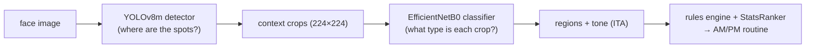

# SkinScan

**A two-stage acne analysis pipeline, built as a research/learning project.**
A YOLOv8m detector finds candidate lesions on a face image; an EfficientNetB0
classifier types each crop; a rules-based recommender turns the counts into a
conservative skincare routine. Every stage was validated with visual proof
sheets before metrics, and every failed experiment is kept on the record below.

> Not medical software. Cosmetic-concern language only, no diagnosis.



## Results at a glance

| Component | Dataset | Result |
|---|---|---|
| Stage 1 detector (YOLOv8m) | ACNE04 | **F1 = 0.722** @ conf 0.07 / IoU 0.2 |
| SA-RPN detector (Mask R-CNN R50, 10-class) — [`sa-rpn/`](sa-rpn/) | AcneSCU | **mAP@0.50 = 0.499 bbox / 0.498 segm**, recall@0.50 = 0.743 |
| SA-RPN serving A/B: **tile** vs zoom ([§7a](#7a-pipeline-ab--how-should-sa-rpn-see-a-full-photo)) | AcneSCU held-out, 756 lesions | tile **recall 0.70 / label acc 0.92** vs zoom 0.04 / 0.44 → tiles locked ([D-026](docs/DECISIONS.md)) |
| Stage 2 classifier (EfficientNetB0, 5-class) | Kaggle acne types | **91.2% acc, macro F1 0.92** |
| 6-class `Not_acne` retrain | + harvested negatives | 91.7% acc — **reverted** (crop-domain confound, [D-025](docs/DECISIONS.md)) |
| Learned product ranker (HistGB) | 1.1M Sephora reviews | pairwise 0.584 — **lost** to Bayesian stats baseline (0.609), never shipped |
| Shipped ranker (`StatsRanker`) | same | pairwise **0.609** (the bake-off winner) |

All decisions are logged with IDs in [`docs/DECISIONS.md`](docs/DECISIONS.md); the
dead ends are summarized in [§8](#8-wrong-paths--what-failed-and-why).

---

## 0. Method: contracts before models

Before training anything, we locked the data contracts (D-007..D-009): a closed
concern vocabulary, a closed face-region vocabulary, ordinal severity 0–4, and a
catalog schema. The CV stages were then built to *fill* those contracts, so the
recommender never had to chase moving model outputs.

```text
concerns: acne_comedonal | acne_inflammatory | acne_cystic | hyperpigmentation | dryness
regions:  forehead | nose | left_cheek | right_cheek | chin_jaw | perioral
datasets: ACNE04 (detection) · Kaggle types (classification) · FFHQ (negatives)
          · Sephora ~8k products / 1.1M reviews (ranking) · self photos (TEST-ONLY)
```

---

## 1. Stage 1 — lesion detector

Trained YOLOv8m on ACNE04 (1,457 dermatologist-boxed faces, 18,983 boxes),
single class `lesion`, COCO-pretrained, full fine-tune on a Colab T4 —
walkthrough in [`notebooks/01_acne04_detector.md`](notebooks/01_acne04_detector.md).
We started with YOLOv8-nano and upgraded to medium (D-018) after nano
underperformed.

First step was always eyeballing the labels, not metrics:


Confidence-threshold sweep picked the locked operating point:

```text
weights: models/detection/acne04_yolov8m_best.pt
conf=0.07  iou=0.2  imgsz=1024  →  precision 0.697 / recall 0.750 / F1 0.722
```

The low threshold is deliberate: a missed spot is gone forever, but an extra
crop can still be rejected downstream. Green = ground truth, red = predictions:


---

## 2. Stage 2 — acne type classifier

### 2a. Attempt 1 — ACNE04 crops, labeled by hand

The first classifier was trained on detector crops from ACNE04 that we labeled
ourselves, at concern level: `comedonal, cystic, inflammatory, not_acne,
post_acne_mark`. It didn't hold up:


The diagonal is weak almost everywhere (inflammatory recall 20/56, cystic
10/30). The error audit showed why — at crop scale, fading inflammatory
lesions and post-acne marks are nearly the same red dot:


Two takeaways: (1) self-labeled concern-level crops were too noisy to learn
from; we needed a properly typed dataset. (2) One class *did* work —
`not_acne` was the strongest row (23/36), the first evidence that a learned
reject class is viable. Its negatives came from harvested detector
false-positive crops (hair, shadows, fabric, plain skin):


### 2b. Attempt 2 — Kaggle acne-type dataset, retrained on Colab

We swapped to the Kaggle acne-type dataset (five real types: `Blackheads,
Cyst, Papules, Pustules, Whiteheads`) and retrained EfficientNetB0 on a Colab
T4 ([`notebooks/retrain_stage2_colab.ipynb`](notebooks/retrain_stage2_colab.ipynb)).

Label review first, as always:


```text
runtime: Colab T4 · TF 2.20 · Adam(1e-5) · 150 epochs · best-val checkpoint
split:   train 2778 / valid 921 / test 918
result:  test accuracy ~92% · macro F1 0.92–0.93
```


A clean diagonal this time. Papules↔Pustules is the remaining soft spot (both
inflammatory-looking crops); Whiteheads is the small tail (57 test images)
but scores highest.

---

## 3. End-to-end pipeline

Wiring detector → context crop → classifier; the JSON output keeps box,
detector confidence, crop path, and full probability vector per candidate:

```bash
.venv/bin/python -m src.classification.run_acne04_pipeline --image path/to/image.jpg
```


End-to-end test on a self-collected photo with real acne, using the new
Kaggle-trained model — this one is a *good* result: the detector finds the
lesions and the classifier types them as pustules, which matches the photo:


```text
detections: 16 · type counts: Pustules = 16 · classifier confidence 0.47–1.00
```

The remaining worry: a 5-way softmax still has no way to say "none of these,"
so weak detector boxes (shadows, pores, hair) get forced onto an acne type
too. That's what the `Not_acne` class from attempt 1 was supposed to fix —
next section.

---

## 4. Adding `Not_acne` to the new model — right idea, wrong dataset

`Not_acne` had already worked on the small self-labeled model (§2a), so we
brought it to the Kaggle model. Design
([`docs/STAGE2_NEGATIVES_DESIGN.md`](docs/STAGE2_NEGATIVES_DESIGN.md)): a sixth
class beat probability thresholding (softmax miscalibrated on OOD crops) and a
two-stage binary gate (over-engineered). Negatives = FFHQ clear-skin detector
false positives + non-lesion ACNE04 regions, harvested through the *same*
`crop_with_context` transform the pipeline uses.

On paper the 6-class retrain worked perfectly:

```text
test accuracy 91.72% · macro F1 0.93 (up from 0.92)
only 2/918 real lesion crops misrouted to Not_acne
FFHQ clear-skin reject rate: 99.7% (382/383)
```

**Then the end-to-end run fell apart (D-025).** On real faces the model
classified essentially *every* detector crop `Not_acne` — including crops that
are unmistakably pustules, at confidence 1.00:


Root cause: a **crop-domain confound** — the acne positives were 640×640
Roboflow mosaic images, while the negatives were 224px upscaled pipeline
crops. The model learned crop *style*, not acne. Every dataset-level
acceptance gate passed anyway, because none of them fed real pipeline crops
of a known-acne face through the model.

```text
lesson: dataset-level metrics can be perfect while the deployed model is 100% broken.
fix:    weights reverted to the 5-class model; v2 gates now require a
        real-pipeline check ("Not_acne share on a known-acne image < 50%").
```

The confounded weights are archived as `acne_model_6class_v1_confounded.keras`;
the v2 dataset plan is in [§7](#7-in-progress--stage-2-v2--sa-rpn-replication).

---

## 5. Face regions and skin tone

MediaPipe FaceLandmarker (468 landmarks) assigns each lesion to a face region
via point-in-polygon (D-020); skin tone is estimated by ITA° in CIELAB over
non-lesional forehead/cheek pixels, bucketed light/medium/deep, with
self-report always overriding the photo (D-021).

```text
ITA° = arctan((L* − 50) / b*) · 180/π
```


Green marks the exact pixels sampled for ITA (lesion boxes excluded):


A fairness-eval design ([`docs/FAIRNESS_EVAL_DESIGN.md`](docs/FAIRNESS_EVAL_DESIGN.md))
specifies how the pooled scalars (F1 0.722, acc 91.2%) will be disaggregated by
Fitzpatrick group — ACNE04 ships no tone labels, so ITA is the estimator.

---

## 6. Recommendation layer

**Rules gate first, learned ranking second (D-005).** A hand-written ~40-row
concern → active → product table ([`docs/RULES.md`](docs/RULES.md)) is the
auditable safety gate: retinoids pinned to PM, pregnancy strips retinoids,
cystic severity routes to soothe-only + a see-a-dermatologist flag,
comedogenic flags always dominate any learned score.

```text
Blackheads, Whiteheads → comedonal     → salicylic acid / adapalene / azelaic acid
Papules, Pustules      → inflammatory  → benzoyl peroxide / azelaic / niacinamide
Cyst                   → cystic        → soothing support + professional-care flag
```

**The ranker bake-off (D-022).** A gradient-boosting model trained on 1.1M
Sephora reviews shipped *only if* it beat both a popularity baseline and a
Bayesian-smoothed rating baseline. It lost:

```text
                         ROC-AUC   pairwise ordering
learned HistGB model      0.659        0.584
global popularity         0.672        0.597
Bayesian-smoothed rating  0.666        0.609   ← champion
```

Seven follow-up probes (target encoding, objective switch, per-skin-type
cells, text features, …) all failed — the loss is structural, so the model
artifact was never written. The shipped ranker is `StatsRanker`, the Bayesian
champion (1,591 products, global mean 4.311), and the gate is now a ratchet:
a future learned model ships only if it beats 0.609 on both metrics.

**Concern-efficacy labeling (D-023, in progress).** Instead of predicting
star ratings, mine review *text* for per-concern outcomes
(helped/worsened/unclear) via a one-time LLM pass (OpenRouter, ~$9 budget),
then rank by concern-conditioned Bayesian stats. Gate P1 (mention density:
970 products ≥ the 300 floor) **passed**; P2 (calibration) and P3 (must beat
the pooled StatsRanker) are pending.

**Ingredient KB (D-024).** A ~1k-product ingredient knowledge base
(comedogenicity/irritancy per ingredient, CC-BY-NC-4.0) powers a tier-2
fallback catalog — used only as a ranking tiebreaker and only when no
review-backed candidate exists.

**End-to-end output.** Running `src.pipeline.e2e` on a real acne photo
produces `runs/e2e/<stem>/routine.json` — per-region concerns, tone, safety
flags, and a ranked AM/PM routine. Excerpt from an actual run
(`runs/e2e_final/acne/routine.json`):

```jsonc
{
  "concerns": [
    {"concern": "acne_comedonal",    "region": "left_cheek", "severity": 2, "lesion_count": 6},
    {"concern": "acne_cystic",       "region": "chin_jaw",   "severity": 1, "confidence": 0.919},
    {"concern": "acne_inflammatory", "region": "chin_jaw",   "severity": 1, "confidence": 0.322}
  ],
  "tone": {"bucket": "light", "ita": 56.7},
  "flags": ["see a dermatologist", "acne_inflammatory@chin_jaw: possible — verify"],
  "target_actives": ["centella", "ceramides", "hyaluronic_acid"],
  "routines": {"AM": {"cleanser": ["CLINIQUE Clarifying Lotion 2", "…"],
                      "serum": ["The INKEY List Niacinamide Oil Control Serum", "…"],
                      "spf": ["Supergoop! Daily Dose SPF 40", "…"]},
               "PM": {"…": "…"}}
}
```

The safety rules are visible in the output: a cystic concern was detected, so
the routine switched to **soothe-only actives** (no benzoyl peroxide, no
retinoids) and raised the *see a dermatologist* flag; a low-confidence
inflammatory concern (0.322) is reported as "possible — verify" instead of
being silently trusted.

---

## 7. SA-RPN detector — trained, evaluated, and served ✅

Full writeup, code, and reproduction: [**`sa-rpn/`**](sa-rpn/).

Replicated Zhang et al.'s *Learning High-quality Proposals for Acne Detection*
(SA-RPN — a Spatial-Aware RPN with NWD proposal scoring and deformable convs on
Mask R-CNN R50-FPN) on AcneSCU with MMDetection. 275 clinical faces tiled into
1024×1024 crops (4,680 train / 529 val tiles), fine-tuned from COCO for 15 epochs
on a Lightning AI A100. Unlike the shipped YOLOv8m detector (single `lesion`
class), this predicts **10 fine-grained lesion types with per-lesion masks**.

| Metric | bbox | segm | | paper target |
|---|---|---|---|---|
| **mAP @ 0.50** | **0.499** | **0.498** | | AP 0.507 |
| **Recall @ 0.50** | **0.743** | **0.742** | | AR 0.775 |
| mAP @ [.50:.95] | 0.174 | 0.169 | | — |

Validation mAP jumps 0.43 → 0.50 exactly at the epoch-9 LR drop, then plateaus —
the model converged; more epochs at this recipe would not help. Detections on
held-out crops it never trained on (red boxes = model output at conf ≥ 0.5):


Served as a batched [LitServe](https://github.com/Lightning-AI/LitServe) REST API
([`sa-rpn/serve.py`](sa-rpn/serve.py)) with class-agnostic NMS and a confidence
knob. **Caveats:** strict-IoU localization is weak (mAP@0.75 ≈ 0.08) — the next
lever is anchor/mask-head tuning, not more training; and the available mirror
lacks patient IDs, so the paper's patient-disjoint split can't be reproduced
exactly (split is image-level).

## 7a. Pipeline A/B — how should SA-RPN see a full photo?

The model is trained on 1024px tiles of clinical photos; a full face photo has
to be funneled into that input somehow. Two candidates, A/B-tested by
[`src/pipeline/compare_sarpn.py`](src/pipeline/compare_sarpn.py) against the
same served checkpoint on 5 held-out validation images (seed-42 split, 756
annotated lesions), scored against the clinical annotations at IoU ≥ 0.3:

- **zoom** — the shipped YOLOv8m finds acne areas, each cluster is cropped and
  *upscaled* to 1024px ("really enlarge the area"), SA-RPN re-detects inside;
- **tile** — the photo is chunked into *native-resolution* 1024px tiles with a
  guaranteed minimum overlap; every tile runs; seams are deduped client-side.

| funnel | recall | precision | exact-label acc | concern acc | API calls (5 imgs) |
|---|---|---|---|---|---|
| zoom | 4% (32/756) | 52% | 44% | 62% | 44 |
| **tile** | **70% (530/756)** | **68%** | **92%** | **95%** | 116 |


Ground truth 282 lesions; zoom surfaced 8, tile surfaced 254 with 91% correct
types. Zoom fails twice: YOLO (imgsz 1024) downscales a 3448×4600 photo ~4×
so the gatekeeper forwards almost nothing, and the upscaled blurry crops halve
SA-RPN's label accuracy versus native pixels. **Decision: native-res tiling,
locked as [D-026](docs/DECISIONS.md)** — the v2 identification pipeline is
tiles → SA-RPN → cross-tile dedupe → regions → ConcernReport (comedones →
comedonal, papules/pustules → inflammatory, nodules → cystic, scars/melasma →
hyperpigmentation — the first CV path to emit a non-acne concern) → the
unchanged recommender contract. Honest caveat: clinical images are tiling's
home domain; a consumer-photo check (D-014) gates retiring the shipped
two-stage pipeline.

## 7b. In progress — Stage 2 v2 dataset

**Stage 2 v2 dataset** ([`docs/STAGE2_V2_DATASET.md`](docs/STAGE2_V2_DATASET.md)),
motivated by D-025. Auditing the Roboflow training data revealed a second data
problem: augmented copies of the same source face leak across train/val/test
(e.g. Blackheads — 735 train files but only ~91 source images, 61 present in all
three splits). The v2 plan: harvest crops by running the *deployed* detector on
AcneSCU faces (276 faces, 31,777 fine-grained annotations) so train crops match
deployment crops, human-review every label
(`src/classification/curate_acne04_crops.py` audit/harvest/build CLI), and split
by source face *before* augmenting. Seven gates must pass before v2 replaces the
shipped 5-class model.

---

## 8. Wrong paths — what failed, and why

Kept on the record deliberately; half the value of the project is here.

| # | Dead end | Symptom | Root cause | Resolution |
|---|---|---|---|---|
| 1 | YOLOv8-nano detector | weak recall on small dense lesions | model too small | upgraded to YOLOv8m (D-018) |
| 2 | Self-labeled concern-level classifier | weak diagonal; inflammatory ↔ post-acne marks indistinguishable | noisy hand labels, crop too small for concern-level classes | switched to the typed Kaggle dataset (§2b) |
| 3 | 6-class retrain v1 | real pustule crops → `Not_acne` @ 1.00, on acne faces too | crop-domain confound: 640px mosaic positives vs 224px pipeline-crop negatives | reverted to 5-class (D-025); v2 requires real-pipeline gate |
| 4 | Roboflow split trust | v2 audit: same source face in train *and* test | augmentation done before splitting | v2 splits by source face first |
| 5 | Learned product ranker | pairwise 0.584 vs baseline 0.609 | product-anonymous features can't beat per-product memorized stats; 7 probes confirmed structural | shipped `StatsRanker` champion (D-022) |
| 6 | Per-skin-type ranking cells | 0.606/0.596 — *worse* than pooled | cells too sparse | pooled stats, cells evidence-only |
| 7 | Softmax-threshold reject (option B) | — | miscalibrated on OOD, per design analysis | rejected at design stage |
| 8 | Zoom funnel into SA-RPN (YOLO areas → upscaled 1024px crops) | recall 4% vs tiling's 70%; label acc 44% vs 92% | YOLO downscales hi-res photos ~4× and gatekeeps coverage; upscaled crops blur away detail | native-res tiling locked (D-026, §7a) |

The recurring lesson: **every proxy metric passed while the real thing was
broken** — which is why each stage now has a visual proof sheet and a
real-pipeline acceptance gate, not just held-out accuracy.

---

## 9. Run it

```bash
python3 -m venv .venv
.venv/bin/python -m pip install -r requirements.txt

# MediaPipe face landmarker (local, gitignored)
mkdir -p models
curl -fL -o models/face_landmarker.task \
  https://storage.googleapis.com/mediapipe-models/face_landmarker/face_landmarker/float16/latest/face_landmarker.task
```

One command, image → detections → types → regions → tone → ranked AM/PM
routine (`runs/e2e/<stem>/routine.json`):

```bash
.venv/bin/python -m src.pipeline.e2e --image path/to/image.jpg \
  [--skin-type dry] [--pregnant] [--top 5]
```

Individual stages:

```bash
.venv/bin/python -m src.detection.check_acne04_detector          # detector proof sheet
.venv/bin/python -m src.classification.run_acne04_pipeline \
  --image path/to/image.jpg                                      # detect + classify
.venv/bin/python -m src.pipeline.regions IMG --boxes PRED_JSON   # region overlay
.venv/bin/python -m src.pipeline.tone    IMG --boxes PRED_JSON   # ITA sampling overlay
.venv/bin/python -m src.pipeline.compare_sarpn --image IMG \
  --api http://localhost:8000/predict                            # SA-RPN tile/zoom A/B (§7a)
```

Tests (default tier is model-free; the second tier needs local weights):

```bash
.venv/bin/python -m pytest
SKINSCAN_REAL_FACE_IMAGE=path/to/photo.jpg .venv/bin/python -m pytest -m real_models
```

<details>
<summary>Optional: rebuild the recommendation data (Sephora catalog, ingredient KB, concern labels, ranker)</summary>

```bash
# Learned-ranker bake-off (ships only if it beats StatsRanker — it currently doesn't):
.venv/bin/python -m src.recommendation.ranker

# Ingredient KB + tier-2 catalog (manual download; dataset is CC-BY-NC-4.0):
mkdir -p data/raw/beautyapi
curl -L -o data/raw/beautyapi/beauty_data.jsonl \
  https://huggingface.co/datasets/thebeautyapi/beautyproducts/resolve/main/beauty_data.jsonl
.venv/bin/python -m src.recommendation.ingredient_kb
.venv/bin/python -m src.recommendation.import_catalog \
  --csv data/raw/sephora/product_info.csv --format sephora \
  --kb data/processed/ingredient_kb.json
.venv/bin/python -m src.recommendation.import_catalog \
  --csv data/raw/beautyapi/beauty_data.jsonl --format beautyapi \
  --kb data/processed/ingredient_kb.json --out data/processed/catalog_tier2.json

# Concern-efficacy labeling (D-023; needs OPENROUTER_API_KEY, budget-capped):
.venv/bin/python -m src.recommendation.concern_labels probe
.venv/bin/python -m src.recommendation.concern_labels calibrate
.venv/bin/python -m src.recommendation.concern_labels label --yes --p2-approved
.venv/bin/python -m src.recommendation.concern_stats
```

</details>

---

## Repo map

```text
sa-rpn/                SA-RPN Mask R-CNN detector (§7): training, serving API, results
docs/DECISIONS.md      every decision (D-001..D-025), including the reversals
docs/*.md              design docs: negatives, v2 dataset, rules, schemas, fairness
notebooks/             Colab sessions: detector training, Stage 2 retrain, SA-RPN
src/detection/         YOLO checks + AcneSCU/SA-RPN preprocessing
src/classification/    classifier training, pipeline, v2 crop curation
src/pipeline/          regions, tone/ITA, end-to-end CLI, SA-RPN tile/zoom A/B
src/recommendation/    rules engine, rankers, concern labels, ingredient KB
assets/                the proof sheets embedded above
tests/                 model-free by default; real_models tier for local weights
```

Raw data, model weights, and run outputs are local-only (gitignored):
`data/raw/ · data/processed/ · data/self_collected/ · models/ · runs/`.
