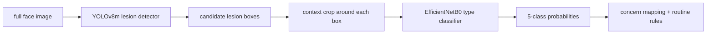

# SkinScan

**A two-stage acne analysis pipeline.** Feed it a face image; it first finds
candidate acne lesions, then classifies each detected crop as one of five acne
types: **Blackheads, Cyst, Papules, Pustules, Whiteheads**.

The important idea is separation: the detector answers **where are the spots?**
and the classifier answers **what type does this crop look like?** The
recommender is deliberately rules-based and only consumes the model outputs.

This is not medical software. It is a computer-vision learning project that uses
cosmetic concern language only.



Current run summary:

```text
Stage 1 detector: YOLOv8m on ACNE04, F1=0.722 at conf=0.07 / IoU=0.2
Stage 2 classifier: EfficientNetB0 on acne type crops, test accuracy=91.18%
Custom image test: 16 detections, all classified as Pustules
```

---

## 1. Stage 1 - lesion locator

The locator is a YOLOv8m detector trained for acne spot boxes. It runs on the
full image and returns rectangular candidate lesions. Those boxes are not the
final answer; they are the input to the classifier.

Current operating point:

```text
weights: models/detection/acne04_yolov8m_best.pt
data:    ACNE04
conf:    0.07
iou:     0.2
imgsz:   1024
```

Training provenance: [notebooks/01_acne04_detector.md](notebooks/01_acne04_detector.md) (Colab walkthrough that produced these weights).

On ACNE04 validation, the best saved sweep point is:

```text
precision=0.697
recall=0.750
F1=0.722
```

That low confidence threshold is intentional. For this pipeline, missing a real
spot is worse than passing a few extra crops forward. The classifier and visual
review can reject weak crops later; an undetected spot is gone.

Green boxes are ACNE04 labels. Red boxes are detector predictions:


How to read this image:

- Good: red boxes land on the same lesion neighborhoods as green boxes.
- Acceptable: red boxes are slightly larger because the classifier wants context.
- Watch out: extra red boxes become extra classifier crops, so they affect type
  counts even when they are not true lesions.

---

## 2. Stage 2 - acne type classifier

The classifier is an EfficientNetB0 transfer-learning model trained on cropped
lesion images. It only sees a crop, not the full face.

Raw output classes:

```python
["Blackheads", "Cyst", "Papules", "Pustules", "Whiteheads"]
```

Training setup:

```text
runtime:        Colab T4
TensorFlow:     2.20.0
architecture:   EfficientNetB0 + GAP + BatchNorm + Dense(128) + Dropout
optimizer:      Adam(1e-5)
epochs:         150
checkpointing:  best validation accuracy
input:          raw RGB 224x224 crops, pixel values 0-255
```

Dataset split:

```text
train: 2778 images
valid:  921 images
test:   918 images
```

Latest T4 result:

```text
best validation accuracy: 0.8979
test loss: 0.4999
test accuracy: 0.9118
macro F1: 0.92
weighted F1: 0.91
```

Per-class test report:

| Class | Precision | Recall | F1 | Support |
|---|---:|---:|---:|---:|
| Blackheads | 0.94 | 0.95 | 0.95 | 265 |
| Cyst | 0.92 | 0.93 | 0.92 | 189 |
| Papules | 0.88 | 0.87 | 0.88 | 202 |
| Pustules | 0.88 | 0.87 | 0.88 | 205 |
| Whiteheads | 0.98 | 0.96 | 0.97 | 57 |

Training curves:


Confusion matrix:


Interpretation:

- The classifier is strongest on **Whiteheads** and **Blackheads** in this test
  set.
- **Papules** and **Pustules** are the hardest pair. That makes sense visually:
  both are inflammatory-looking crops, and the distinction can be subtle.
- The model should be treated as a crop-level type scorer, not a diagnosis.
  Confidence is evidence for the crop label, not severity.

---

## 3. Detector-to-classifier pipeline

The full pipeline crops each detector box with extra context, resizes to
224x224, and sends the crop into the classifier. The output JSON keeps the box,
detector confidence, crop path, predicted type, and full probability vector for
each lesion candidate.

```text
face image -> boxes -> context crops -> type probabilities -> type counts
```

Detector crop inputs:


End-to-end crop predictions:


How to interpret a pipeline run:

- `detection_count` is the number of candidate lesions YOLO found.
- `acne_type_counts` is a summary of classifier top-1 labels across those crops.
- A high classifier probability on a bad detector crop is still a bad result.
  Always inspect the crop sheet when judging a new image.
- Detector confidence and classifier probability are different numbers. Detector
  confidence says "this box looks like a lesion"; classifier probability says
  "this crop looks like this type."

---

## 4. My image test

I ran the full detector-to-classifier pipeline on a self-collected image:

```bash
.venv/bin/python -m src.classification.run_acne04_pipeline \
  --image data/self_collected/acne-before-scaled-e1764168292784.png \
  --out runs/my_image_test
```

Result summary:

```text
detections: 16
predicted acne types: Pustules
type counts: Pustules=16
classifier confidence range: 0.47-1.00
detector confidence range: 0.19-0.37
```

Detection overlay:


Detected lesion crops and type predictions:


Interpretation:

The classifier was consistent: every crop landed on **Pustules**. The detector
confidences are moderate rather than high, so the right reading is not "16
certain lesions"; it is "YOLO proposed 16 candidate lesions, and the classifier
found the visible crops most similar to Pustules." The crop sheet is the audit
view for deciding which boxes are useful.

---

## 5. Recommendation layer

The recommender is not a learned model. It maps model outputs into conservative
cosmetic concern buckets:

```text
Blackheads, Whiteheads -> comedonal
Cyst                   -> cystic
Papules, Pustules      -> inflammatory
```

Then rules map concerns to ingredients:

```text
comedonal acne     -> salicylic acid / adapalene / azelaic acid
inflammatory acne  -> benzoyl peroxide / azelaic acid / niacinamide
cystic acne        -> soothing support + professional-care flag
```

This layer stays rules-based so the pipeline remains inspectable. The model
scores say what the image looks like; the rules decide how to phrase routine
guidance.

---

## Run it

Install:

```bash
python3 -m venv .venv
.venv/bin/python -m pip install -r requirements.txt
```

Detector check:

```bash
.venv/bin/python -m src.detection.check_acne04_detector
```

Train the type classifier:

```bash
.venv/bin/python -m src.classification.train_type_classifier
```

Run the full pipeline on the default ACNE04 images:

```bash
.venv/bin/python -m src.classification.run_acne04_pipeline
```

Run one image:

```bash
.venv/bin/python -m src.classification.run_acne04_pipeline --image path/to/image.jpg
```

Expected local outputs:

```text
runs/acne04_pipeline_check/predictions.json
runs/acne04_pipeline_check/*_crop_*.jpg
runs/acne04_pipeline_check/*_input_collage.jpg
runs/acne04_pipeline_check/*_crops.jpg
```

Raw data, model weights, and generated runs are intentionally local-only:

```text
data/raw/
data/processed/
data/self_collected/
models/
runs/
*.tar
*.pt
*.keras
```
