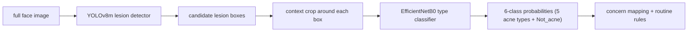

# SkinScan

**A two-stage acne analysis pipeline.** Feed it a face image; it first finds
candidate acne lesions, then classifies each detected crop as one of five acne
types — **Blackheads, Cyst, Papules, Pustules, Whiteheads** — or as
**Not_acne**, a sixth "reject" class so detector false positives (shadows,
pores, glasses, hair) get thrown out instead of forced onto a real acne type.

The important idea is separation: the detector answers **where are the spots?**
and the classifier answers **what type does this crop look like?** The
recommender is deliberately rules-based and only consumes the model outputs.

This is not medical software. It is a computer-vision learning project that uses
cosmetic concern language only.



Current run summary:

```text
Stage 1 detector: YOLOv8m on ACNE04, F1=0.722 at conf=0.07 / IoU=0.2
Stage 2 classifier: EfficientNetB0, 6 classes (5 acne types + Not_acne), test accuracy=91.72%, macro F1=0.93
Not_acne reject:   99.7% of detector boxes on held-out clear-skin (FFHQ) faces
Custom image test: 25 detections, all now classified Not_acne (was 16, all forced to Pustules)
```

---

## 1. Stage 1 - lesion locator

The locator is a YOLOv8m detector trained for acne spot boxes. It runs on the
full image and returns rectangular candidate lesions. Those boxes are not the
final answer; they are the input to the classifier.

Current operating point:

```text
weights: models/detection/acne04_yolov8m_best.pt
data:    ACNE04
conf:    0.07
iou:     0.2
imgsz:   1024
```

Training provenance: [notebooks/01_acne04_detector.md](notebooks/01_acne04_detector.md) (Colab walkthrough that produced these weights).

On ACNE04 validation, the best saved sweep point is:

```text
precision=0.697
recall=0.750
F1=0.722
```

That low confidence threshold is intentional. For this pipeline, missing a real
spot is worse than passing a few extra crops forward. The classifier and visual
review can reject weak crops later; an undetected spot is gone.

Green boxes are ACNE04 labels. Red boxes are detector predictions:


How to read this image:

- Good: red boxes land on the same lesion neighborhoods as green boxes.
- Acceptable: red boxes are slightly larger because the classifier wants context.
- Watch out: extra red boxes become extra classifier crops, so they affect type
  counts even when they are not true lesions.

---

## 2. Stage 2 - acne type classifier

The classifier is an EfficientNetB0 transfer-learning model trained on cropped
lesion images. It only sees a crop, not the full face.

Raw output classes (alphabetical; `Not_acne` at index 2):

```python
["Blackheads", "Cyst", "Not_acne", "Papules", "Pustules", "Whiteheads"]
```

`Not_acne` is a negative/reject class. The detector runs at a deliberately low
confidence threshold, so some boxes it forwards are shadows, pores, or hair
rather than lesions. A five-way softmax has no way to say "none of these" and
forces every crop onto an acne type (see §4). The sixth class gives the model a
learned reject region; its probability mass is intentionally dropped by the
concern mapping, so a `Not_acne` crop contributes to no concern.

Training setup:

```text
runtime:        Colab T4
TensorFlow:     2.20.0
architecture:   EfficientNetB0 + GAP + BatchNorm + Dense(128) + Dropout
optimizer:      Adam(1e-5)
epochs:         150
checkpointing:  best validation accuracy
input:          raw RGB 224x224 crops, pixel values 0-255
```

Retrain provenance: [notebooks/retrain_stage2_colab.ipynb](notebooks/retrain_stage2_colab.ipynb) (Colab walkthrough: harvest `Not_acne` negatives → retrain → run the acceptance checks).

Dataset split (five acne classes below; the `Not_acne` sixth class adds
harvested crops, its train count held ≤ 735 = the largest acne class):

```text
train: 2778 images
valid:  921 images
test:   918 images
```

Latest T4 result (6-class model; metrics on the five acne test classes):

```text
best validation accuracy: 0.9193   (epoch 128 of 150)
test accuracy:            0.9172
macro F1:                 0.93
weighted F1:              0.92
```

Per-class test report:

| Class | Precision | Recall | F1 | Support |
|---|---:|---:|---:|---:|
| Blackheads | 0.94 | 0.94 | 0.94 | 265 |
| Cyst | 0.93 | 0.95 | 0.94 | 189 |
| Papules | 0.89 | 0.85 | 0.87 | 202 |
| Pustules | 0.89 | 0.91 | 0.90 | 205 |
| Whiteheads | 0.98 | 0.98 | 0.98 | 57 |

The table covers the five acne classes only. Adding the sixth class did **not**
regress them — macro F1 is **0.93** (was 0.92), and only **2 of 918** real-lesion
test crops were misrouted to `Not_acne`. `Not_acne` is not in this test set (the
dermatologist-boxed ACNE04 has no clear-skin crops), so it is measured by its
reject rate instead: on a held-out FFHQ clear-skin sheet the detector never saw
during harvesting, **99.7%** (382/383) of detector boxes are correctly classified
`Not_acne`.

Training curves:


Confusion matrix (five acne classes; `Not_acne` measured by reject rate above):


Interpretation:

- **Whiteheads** and **Cyst** are strongest here (F1 0.98 / 0.94). **Papules** is
  the softest (recall 0.85), still mostly confused with **Pustules** — both are
  inflammatory-looking crops, so the distinction stays subtle.
- The sixth class was learned cleanly: the reject region did not eat into the
  real classes (macro F1 rose 0.92 → 0.93; only 2/918 real crops misrouted to
  `Not_acne`).
- The model is a crop-level type scorer, not a diagnosis. Confidence is evidence
  for the crop label, not severity.

---

## 3. Detector-to-classifier pipeline

The full pipeline crops each detector box with extra context, resizes to
224x224, and sends the crop into the classifier. The output JSON keeps the box,
detector confidence, crop path, predicted type, and full probability vector for
each lesion candidate.

```text
face image -> boxes -> context crops -> type probabilities -> type counts
```

Detector crop inputs:


End-to-end crop predictions:


How to interpret a pipeline run:

- `detection_count` is the number of candidate lesions YOLO found.
- `acne_type_counts` is a summary of classifier top-1 labels across those crops.
- A high classifier probability on a bad detector crop is still a bad result.
  Always inspect the crop sheet when judging a new image.
- Detector confidence and classifier probability are different numbers. Detector
  confidence says "this box looks like a lesion"; classifier probability says
  "this crop looks like this type."

---

## 4. My image test

This image is the project's canonical failure case — a self-collected photo of
essentially clear skin. I ran the full detector-to-classifier pipeline on it:

```bash
.venv/bin/python -m src.classification.run_acne04_pipeline \
  --image data/self_collected/acne-before-scaled-e1764168292784.png \
  --max-boxes 100 --out runs/my_image_test
```

**Before the `Not_acne` class**, the five-way softmax had no reject option, so
every candidate box was forced onto an acne type:

```text
detections: 16
type counts: Pustules=16
classifier confidence range: 0.47-1.00
detector confidence range: 0.19-0.37
```

Sixteen crops of clear skin, all reported **Pustules**, some at 1.00 confidence —
the classic out-of-distribution softmax failure. A high classifier probability on
a weak detector box (detector conf 0.19-0.37) is not evidence of a lesion.

**After adding `Not_acne` and retraining**, the same image rejects cleanly:

```text
detections: 25
type counts: Not_acne=25
classifier confidence range: 0.59-1.00 (mean 0.98)
detector confidence range: 0.07-0.37
```

Every detector box now classifies **Not_acne**, so the spurious pustules are
gone. Because the concern mapping drops `Not_acne`, this image produces zero acne
concerns — the correct outcome for clear skin.

Detection overlay:


Detected lesion crops and predictions (all Not_acne after retrain):


---

## 5. Recommendation layer

The recommender is not a learned model. It maps model outputs into conservative
cosmetic concern buckets:

```text
Blackheads, Whiteheads -> comedonal
Cyst                   -> cystic
Papules, Pustules      -> inflammatory
```

Then rules map concerns to ingredients:

```text
comedonal acne     -> salicylic acid / adapalene / azelaic acid
inflammatory acne  -> benzoyl peroxide / azelaic acid / niacinamide
cystic acne        -> soothing support + professional-care flag
```

This layer stays rules-based so the pipeline remains inspectable. The model
scores say what the image looks like; the rules decide how to phrase routine
guidance.

---

## Run it

Install:

```bash
python3 -m venv .venv
.venv/bin/python -m pip install -r requirements.txt
```

Download the MediaPipe FaceLandmarker bundle used for face regions and tone
sampling (model files remain local and gitignored):

```bash
mkdir -p models
curl --fail --location --output models/face_landmarker.task \
  https://storage.googleapis.com/mediapipe-models/face_landmarker/face_landmarker/float16/latest/face_landmarker.task
```

Detector check:

```bash
.venv/bin/python -m src.detection.check_acne04_detector
```

Train the type classifier:

```bash
.venv/bin/python -m src.classification.train_type_classifier
```

Run the full pipeline on the default ACNE04 images:

```bash
.venv/bin/python -m src.classification.run_acne04_pipeline
```

Run one image:

```bash
.venv/bin/python -m src.classification.run_acne04_pipeline --image path/to/image.jpg
```

Render the issue #6 region and tone overlays from that run's JSON:

```bash
.venv/bin/python -m src.pipeline.regions path/to/image.jpg \
  --boxes runs/acne04_pipeline_check/predictions.json
.venv/bin/python -m src.pipeline.tone path/to/image.jpg \
  --boxes runs/acne04_pipeline_check/predictions.json
```

Issue #6 visual gate on the self-collected profile:


Green marks the exact non-lesional forehead/visible-cheek pixels used by ITA:


On profile photos, the smaller projected cheek is treated as occluded when its
area is below `tone.profile_cheek_area_ratio`; this prevents nose/far-side
pixels from dominating ITA.

Run the default model-free tests, then the explicit local-artifact tier:

```bash
.venv/bin/python -m pytest
SKINSCAN_REAL_FACE_IMAGE=path/to/self-collected.jpg \
  .venv/bin/python -m pytest -m real_models
```

Expected local outputs:

```text
runs/acne04_pipeline_check/predictions.json
runs/acne04_pipeline_check/*_crop_*.jpg
runs/acne04_pipeline_check/*_input_collage.jpg
runs/acne04_pipeline_check/*_crops.jpg
```

Raw data, model weights, and generated runs are intentionally local-only:

```text
data/raw/
data/processed/
data/self_collected/
models/
runs/
*.tar
*.pt
*.keras
```
