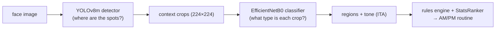
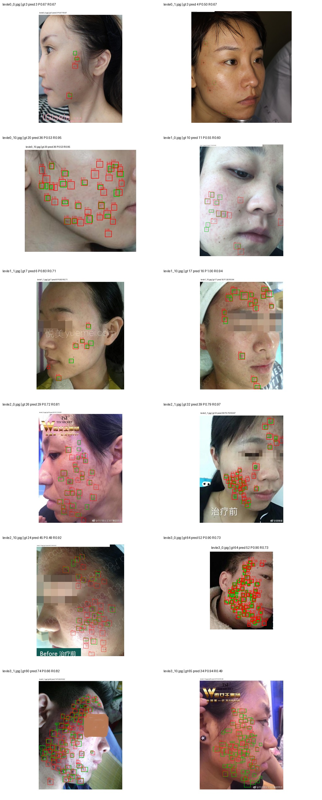
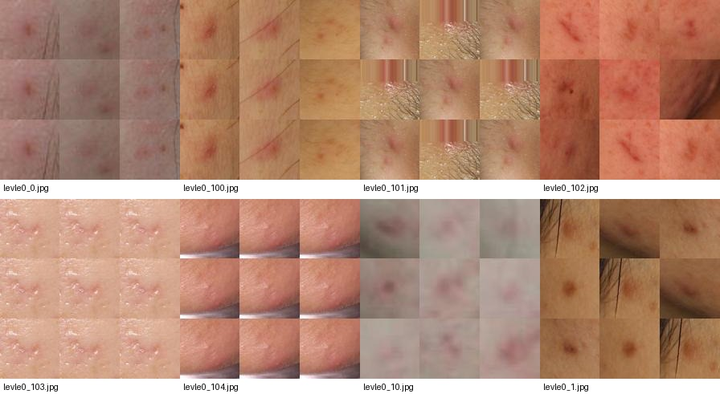
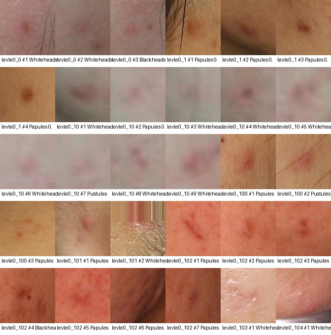
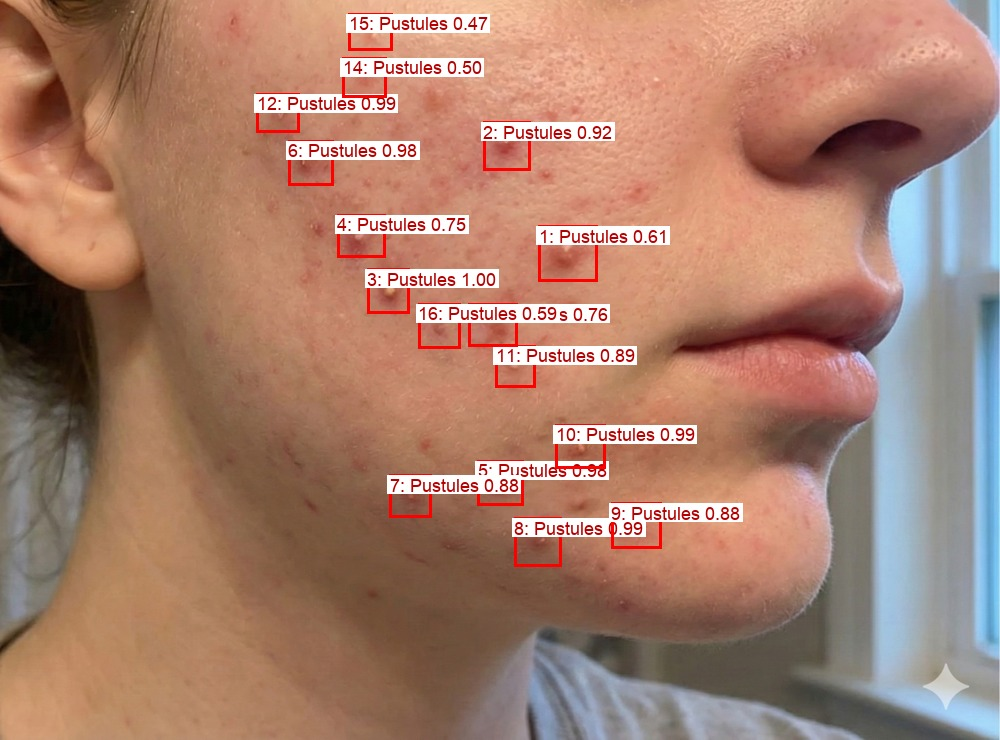
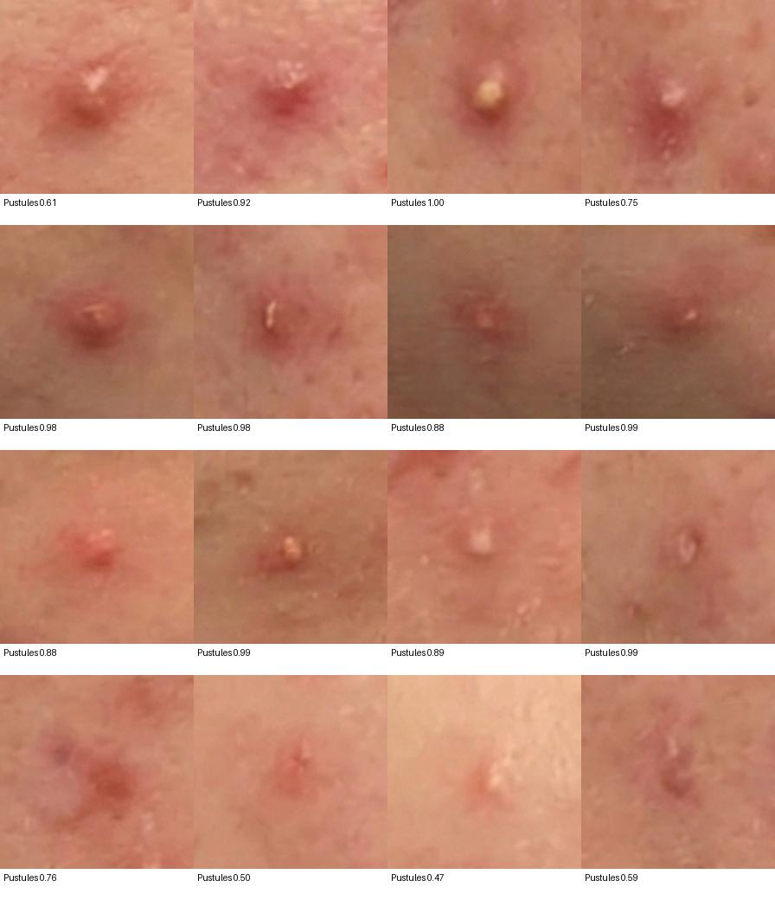
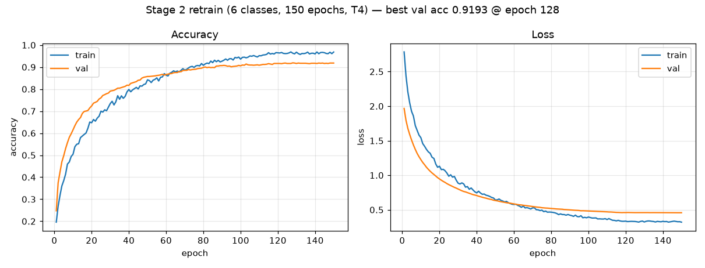
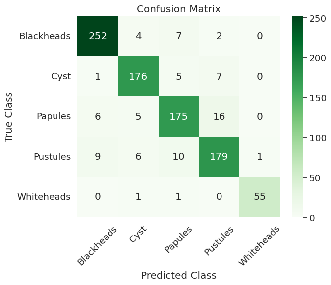
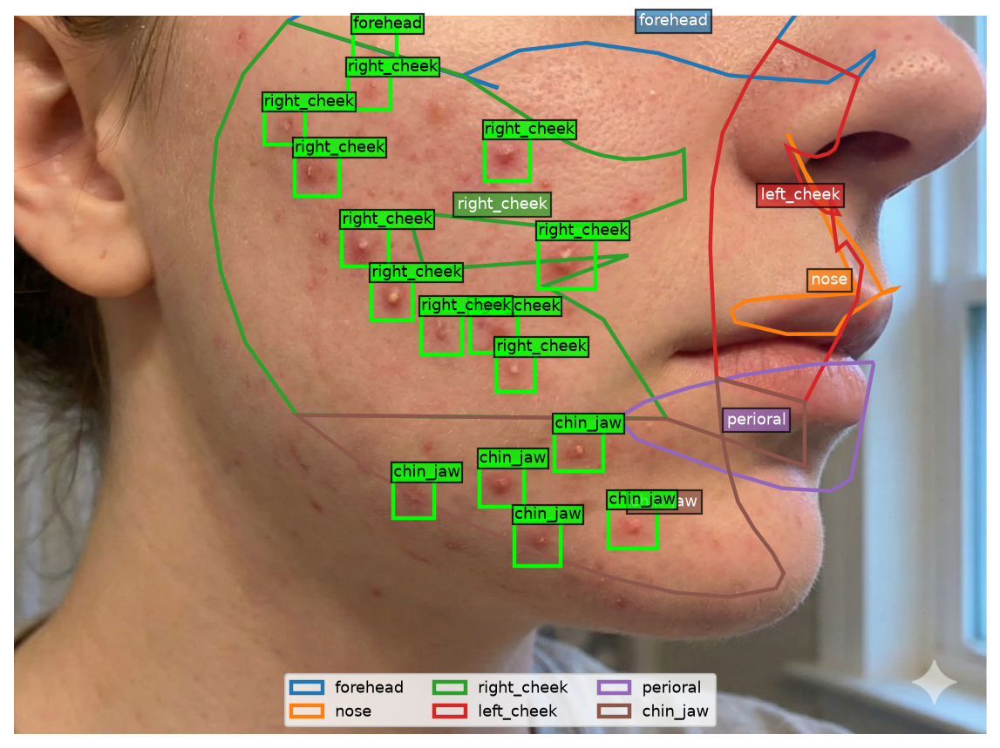
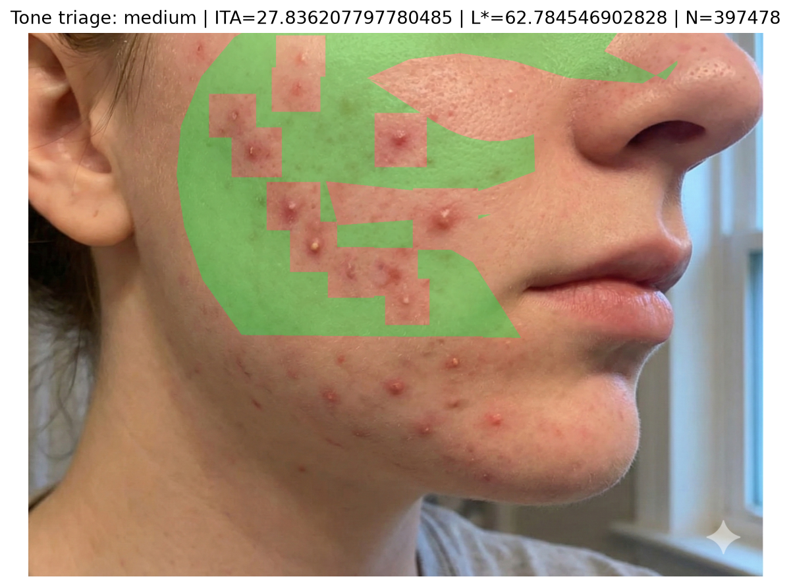

# SkinScan

**A two-stage acne analysis pipeline, built as a research/learning project.**
A YOLOv8m detector finds candidate lesions on a face image; an EfficientNetB0
classifier types each crop; a rules-based recommender turns the counts into a
conservative skincare routine. Every stage was validated with visual proof
sheets before metrics, and every failed experiment is kept on the record below.

> Not medical software. Cosmetic-concern language only, no diagnosis.



## Results at a glance

| Component | Dataset | Result |
|---|---|---|
| Stage 1 detector (YOLOv8m) | ACNE04 | **F1 = 0.722** @ conf 0.07 / IoU 0.2 |
| Stage 2 classifier (EfficientNetB0, 5-class) | Kaggle acne types | **91.2% acc, macro F1 0.92** |
| 6-class `Not_acne` retrain | + harvested negatives | 91.7% acc — **reverted** (crop-domain confound, [D-025](docs/DECISIONS.md)) |
| Learned product ranker (HistGB) | 1.1M Sephora reviews | pairwise 0.584 — **lost** to Bayesian stats baseline (0.609), never shipped |
| Shipped ranker (`StatsRanker`) | same | pairwise **0.609** (the bake-off winner) |

All decisions are logged with IDs in [`docs/DECISIONS.md`](docs/DECISIONS.md); the
dead ends are summarized in [§8](#8-wrong-paths--what-failed-and-why).

---

## 0. Method: contracts before models

Before training anything, we locked the data contracts (D-007..D-009): a closed
concern vocabulary, a closed face-region vocabulary, ordinal severity 0–4, and a
catalog schema. The CV stages were then built to *fill* those contracts, so the
recommender never had to chase moving model outputs.

```text
concerns: acne_comedonal | acne_inflammatory | acne_cystic | hyperpigmentation | dryness
regions:  forehead | nose | left_cheek | right_cheek | chin_jaw | perioral
datasets: ACNE04 (detection) · Kaggle types (classification) · FFHQ (negatives)
          · Sephora ~8k products / 1.1M reviews (ranking) · self photos (TEST-ONLY)
```

---

## 1. Stage 1 — lesion detector

Trained YOLOv8m on ACNE04 (1,457 dermatologist-boxed faces, 18,983 boxes),
single class `lesion`, COCO-pretrained, full fine-tune on a Colab T4 —
walkthrough in [`notebooks/01_acne04_detector.md`](notebooks/01_acne04_detector.md).
We started with YOLOv8-nano and upgraded to medium (D-018) after nano
underperformed.

First step was always eyeballing the labels, not metrics:


Confidence-threshold sweep picked the locked operating point:

```text
weights: models/detection/acne04_yolov8m_best.pt
conf=0.07  iou=0.2  imgsz=1024  →  precision 0.697 / recall 0.750 / F1 0.722
```

The low threshold is deliberate: a missed spot is gone forever, but an extra
crop can still be rejected downstream. Green = ground truth, red = predictions:




---

## 2. Stage 2 — acne type classifier

EfficientNetB0 transfer learning on the Kaggle acne-type dataset, five classes
(`Blackheads, Cyst, Papules, Pustules, Whiteheads`), 224×224 raw-RGB crops.

```text
runtime: Colab T4 · TF 2.20 · Adam(1e-5) · 150 epochs · best-val checkpoint
split:   train 2778 / valid 921 / test 918
result:  test accuracy 91.18% · macro F1 0.92
```

Label review before training, then confusion analysis after:


Papules↔Pustules is the persistent soft spot (both inflammatory-looking crops);
Whiteheads is the small tail (57 test images) but scores highest (F1 0.98).

---

## 3. End-to-end pipeline — and the first big failure

Wiring detector → context crop → classifier, the JSON output keeps box,
detector confidence, crop path, and full probability vector per candidate:

```bash
.venv/bin/python -m src.classification.run_acne04_pipeline --image path/to/image.jpg
```





Then we ran it on a self-collected photo of essentially clear skin:

```text
detections: 16
type counts: Pustules = 16          ← every single crop
classifier confidence: 0.47–1.00    ← some at 1.00
detector confidence:   0.19–0.37    ← all weak boxes
```





Sixteen crops of clear skin, all reported *Pustules*, some at 1.00 confidence.
A five-way softmax has no way to say "none of these" — the classic
out-of-distribution failure. This photo became the project's canonical
regression test.

---

## 4. The `Not_acne` reject class — right idea, wrong dataset

**Design** ([`docs/STAGE2_NEGATIVES_DESIGN.md`](docs/STAGE2_NEGATIVES_DESIGN.md)):
we compared three fixes and chose a sixth `Not_acne` class over probability
thresholding (softmax is miscalibrated on OOD crops) and a two-stage binary
gate (over-engineered). Negatives = FFHQ clear-skin detector false positives +
non-lesion ACNE04 regions, harvested through the *same* `crop_with_context`
transform the pipeline uses:


**Retrain** ([`notebooks/retrain_stage2_colab.ipynb`](notebooks/retrain_stage2_colab.ipynb),
Colab T4, 150 epochs, ~2h). On paper it worked perfectly:

```text
test accuracy 91.72% · macro F1 0.93 (up from 0.92)
only 2/918 real lesion crops misrouted to Not_acne
FFHQ clear-skin reject rate: 99.7% (382/383)
canonical failure photo: 25 detections → Not_acne = 25  ✓
```





**Then it fell apart (D-025).** On real acne-covered faces the model classified
*every* detector crop `Not_acne` at ~1.0. Root cause: a **crop-domain
confound** — the acne positives were 640×640 Roboflow mosaic images, while the
negatives were 224px upscaled pipeline crops. The model learned crop *style*,
not acne. Every acceptance gate we had defined passed anyway, because none of
them fed real pipeline crops of a known-acne face through the model.

```text
lesson: dataset-level metrics can be perfect while the deployed model is 100% broken.
fix:    weights reverted to the 5-class model; v2 gates now require a
        real-pipeline check ("Not_acne share on a known-acne image < 50%").
```

The confounded weights are archived as `acne_model_6class_v1_confounded.keras`;
the v2 dataset plan is in [§7](#7-in-progress--stage-2-v2--sa-rpn-replication).

---

## 5. Face regions and skin tone

MediaPipe FaceLandmarker (468 landmarks) assigns each lesion to a face region
via point-in-polygon (D-020); skin tone is estimated by ITA° in CIELAB over
non-lesional forehead/cheek pixels, bucketed light/medium/deep, with
self-report always overriding the photo (D-021).

```text
ITA° = arctan((L* − 50) / b*) · 180/π
```



Green marks the exact pixels sampled for ITA (lesion boxes excluded):



A fairness-eval design ([`docs/FAIRNESS_EVAL_DESIGN.md`](docs/FAIRNESS_EVAL_DESIGN.md))
specifies how the pooled scalars (F1 0.722, acc 91.2%) will be disaggregated by
Fitzpatrick group — ACNE04 ships no tone labels, so ITA is the estimator.

---

## 6. Recommendation layer

**Rules gate first, learned ranking second (D-005).** A hand-written ~40-row
concern → active → product table ([`docs/RULES.md`](docs/RULES.md)) is the
auditable safety gate: retinoids pinned to PM, pregnancy strips retinoids,
cystic severity routes to soothe-only + a see-a-dermatologist flag,
comedogenic flags always dominate any learned score.

```text
Blackheads, Whiteheads → comedonal     → salicylic acid / adapalene / azelaic acid
Papules, Pustules      → inflammatory  → benzoyl peroxide / azelaic / niacinamide
Cyst                   → cystic        → soothing support + professional-care flag
```

**The ranker bake-off (D-022).** A gradient-boosting model trained on 1.1M
Sephora reviews shipped *only if* it beat both a popularity baseline and a
Bayesian-smoothed rating baseline. It lost:

```text
                         ROC-AUC   pairwise ordering
learned HistGB model      0.659        0.584
global popularity         0.672        0.597
Bayesian-smoothed rating  0.666        0.609   ← champion
```

Seven follow-up probes (target encoding, objective switch, per-skin-type
cells, text features, …) all failed — the loss is structural, so the model
artifact was never written. The shipped ranker is `StatsRanker`, the Bayesian
champion (1,591 products, global mean 4.311), and the gate is now a ratchet:
a future learned model ships only if it beats 0.609 on both metrics.

**Concern-efficacy labeling (D-023, in progress).** Instead of predicting
star ratings, mine review *text* for per-concern outcomes
(helped/worsened/unclear) via a one-time LLM pass (OpenRouter, ~$9 budget),
then rank by concern-conditioned Bayesian stats. Gate P1 (mention density:
970 products ≥ the 300 floor) **passed**; P2 (calibration) and P3 (must beat
the pooled StatsRanker) are pending.

**Ingredient KB (D-024).** A ~1k-product ingredient knowledge base
(comedogenicity/irritancy per ingredient, CC-BY-NC-4.0) powers a tier-2
fallback catalog — used only as a ranking tiebreaker and only when no
review-backed candidate exists.

---

## 7. In progress — Stage 2 v2 + SA-RPN replication

Two active workstreams (uncommitted), both motivated by D-025:

**Stage 2 v2 dataset** ([`docs/STAGE2_V2_DATASET.md`](docs/STAGE2_V2_DATASET.md)).
Auditing the Roboflow training data revealed a second data problem: augmented
copies of the same source face leak across train/val/test (e.g. Blackheads —
735 train files but only ~91 source images, 61 present in all three splits).
The v2 plan: harvest crops by running the *deployed* detector on AcneSCU faces
(276 faces, 31,777 fine-grained annotations) so train crops match deployment
crops, human-review every label (`src/classification/curate_acne04_crops.py`
audit/harvest/build CLI), and split by source face *before* augmenting. Seven
gates must pass before v2 replaces the shipped 5-class model.

**SA-RPN replication** ([`notebooks/train_acnescu_sa_rpn_colab.ipynb`](notebooks/train_acnescu_sa_rpn_colab.ipynb)).
Replicating Zhang et al.'s *Learning High-quality Proposals for Acne Detection*
(paper: AP 0.507 / AR 0.775 @ IoU 0.5) on AcneSCU with MMDetection —
1024×1024 masked tiling preprocessor in
`src/detection/prepare_acnescu_sa_rpn.py`, training on Colab. Caveat: the
available mirror lacks patient IDs, so the paper's patient-disjoint split
can't be reproduced exactly.

---

## 8. Wrong paths — what failed, and why

Kept on the record deliberately; half the value of the project is here.

| # | Dead end | Symptom | Root cause | Resolution |
|---|---|---|---|---|
| 1 | YOLOv8-nano detector | weak recall on small dense lesions | model too small | upgraded to YOLOv8m (D-018) |
| 2 | 5-class softmax, no reject | clear skin → 16× "Pustules" @ conf up to 1.00 | softmax can't say "none of these" | added `Not_acne` class |
| 3 | 6-class retrain v1 | every real crop → `Not_acne` ≈ 1.0, on acne faces too | crop-domain confound: 640px mosaic positives vs 224px pipeline-crop negatives | reverted to 5-class (D-025); v2 requires real-pipeline gate |
| 4 | Roboflow split trust | v2 audit: same source face in train *and* test | augmentation done before splitting | v2 splits by source face first |
| 5 | Learned product ranker | pairwise 0.584 vs baseline 0.609 | product-anonymous features can't beat per-product memorized stats; 7 probes confirmed structural | shipped `StatsRanker` champion (D-022) |
| 6 | Per-skin-type ranking cells | 0.606/0.596 — *worse* than pooled | cells too sparse | pooled stats, cells evidence-only |
| 7 | Softmax-threshold reject (option B) | — | miscalibrated on OOD, per design analysis | rejected at design stage |

The recurring lesson: **every proxy metric passed while the real thing was
broken** — which is why each stage now has a visual proof sheet and a
real-pipeline acceptance gate, not just held-out accuracy.

---

## 9. Run it

```bash
python3 -m venv .venv
.venv/bin/python -m pip install -r requirements.txt

# MediaPipe face landmarker (local, gitignored)
mkdir -p models
curl -fL -o models/face_landmarker.task \
  https://storage.googleapis.com/mediapipe-models/face_landmarker/face_landmarker/float16/latest/face_landmarker.task
```

One command, image → detections → types → regions → tone → ranked AM/PM
routine (`runs/e2e/<stem>/routine.json`):

```bash
.venv/bin/python -m src.pipeline.e2e --image path/to/image.jpg \
  [--skin-type dry] [--pregnant] [--top 5]
```

Individual stages:

```bash
.venv/bin/python -m src.detection.check_acne04_detector          # detector proof sheet
.venv/bin/python -m src.classification.run_acne04_pipeline \
  --image path/to/image.jpg                                      # detect + classify
.venv/bin/python -m src.pipeline.regions IMG --boxes PRED_JSON   # region overlay
.venv/bin/python -m src.pipeline.tone    IMG --boxes PRED_JSON   # ITA sampling overlay
```

Tests (default tier is model-free; the second tier needs local weights):

```bash
.venv/bin/python -m pytest
SKINSCAN_REAL_FACE_IMAGE=path/to/photo.jpg .venv/bin/python -m pytest -m real_models
```

<details>
<summary>Optional: rebuild the recommendation data (Sephora catalog, ingredient KB, concern labels, ranker)</summary>

```bash
# Learned-ranker bake-off (ships only if it beats StatsRanker — it currently doesn't):
.venv/bin/python -m src.recommendation.ranker

# Ingredient KB + tier-2 catalog (manual download; dataset is CC-BY-NC-4.0):
mkdir -p data/raw/beautyapi
curl -L -o data/raw/beautyapi/beauty_data.jsonl \
  https://huggingface.co/datasets/thebeautyapi/beautyproducts/resolve/main/beauty_data.jsonl
.venv/bin/python -m src.recommendation.ingredient_kb
.venv/bin/python -m src.recommendation.import_catalog \
  --csv data/raw/sephora/product_info.csv --format sephora \
  --kb data/processed/ingredient_kb.json
.venv/bin/python -m src.recommendation.import_catalog \
  --csv data/raw/beautyapi/beauty_data.jsonl --format beautyapi \
  --kb data/processed/ingredient_kb.json --out data/processed/catalog_tier2.json

# Concern-efficacy labeling (D-023; needs OPENROUTER_API_KEY, budget-capped):
.venv/bin/python -m src.recommendation.concern_labels probe
.venv/bin/python -m src.recommendation.concern_labels calibrate
.venv/bin/python -m src.recommendation.concern_labels label --yes --p2-approved
.venv/bin/python -m src.recommendation.concern_stats
```

</details>

---

## Repo map

```text
docs/DECISIONS.md      every decision (D-001..D-025), including the reversals
docs/*.md              design docs: negatives, v2 dataset, rules, schemas, fairness
notebooks/             Colab sessions: detector training, Stage 2 retrain, SA-RPN
src/detection/         YOLO checks + AcneSCU/SA-RPN preprocessing
src/classification/    classifier training, pipeline, v2 crop curation
src/pipeline/          regions, tone/ITA, end-to-end CLI
src/recommendation/    rules engine, rankers, concern labels, ingredient KB
assets/                the proof sheets embedded above
tests/                 model-free by default; real_models tier for local weights
```

Raw data, model weights, and run outputs are local-only (gitignored):
`data/raw/ · data/processed/ · data/self_collected/ · models/ · runs/`.
