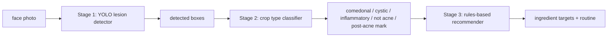
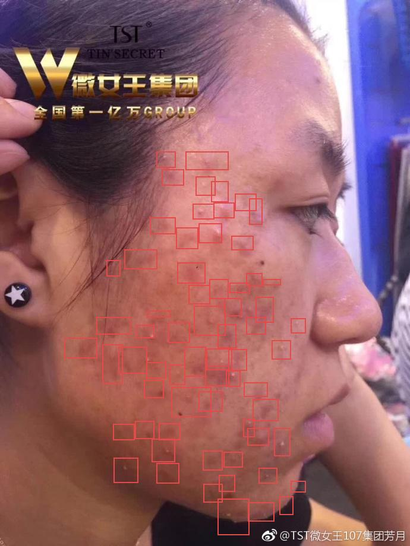
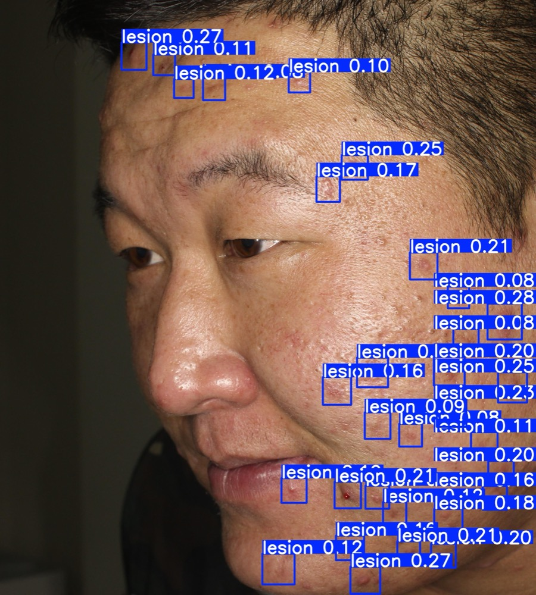
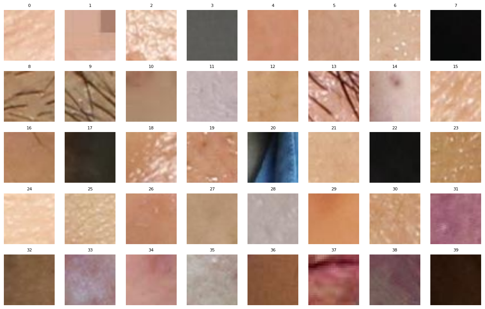
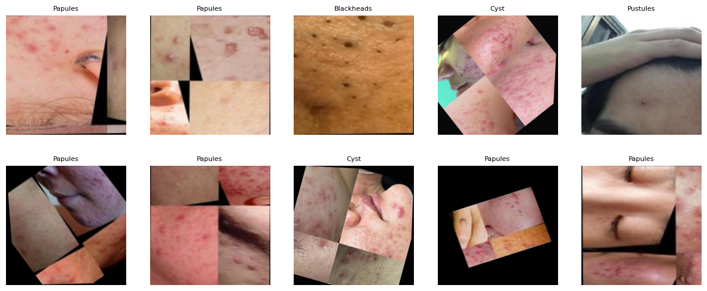
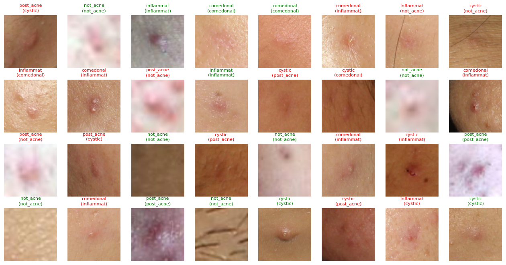
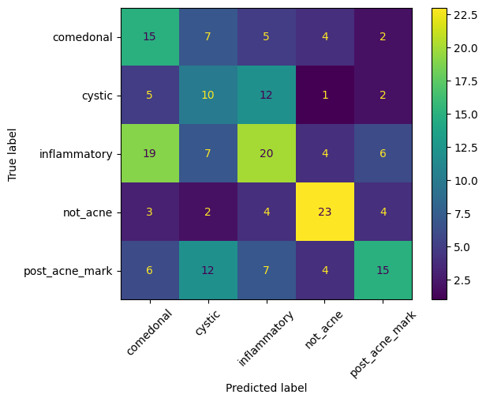
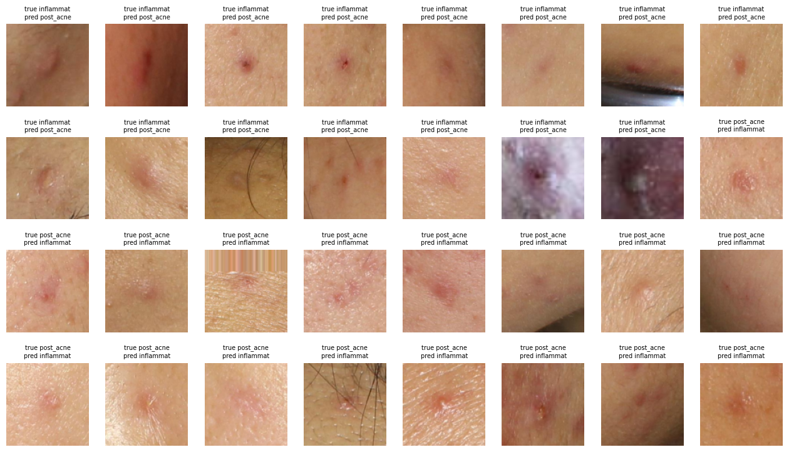

# SkinScan

SkinScan is a learning project for computer vision. The goal was to scan a face,
find visible acne-like skin concerns, classify each detected crop, and feed the
result into a simple ingredient-based skincare recommender.

This is not medical software. The project uses cosmetic language only:
`concerns`, not diagnoses.

> Current status: this repo records the first build attempt before a restart.
> The detector, crop classifier process, rules schema, and lessons below are the
> parts worth carrying forward.



## 1. Project framing

The project was designed around three decisions:

- Use a two-stage CV pipeline: detect lesions first, classify cropped lesions
  second.
- Keep recommendations rules-based. The ML output is uncertain; the ingredient
  logic should stay readable and auditable.
- Treat self-collected phone photos as test-only data, not training data, so the
  domain gap stays measurable.

The main data contracts live in `docs/CONCERN_SCHEMA.md`,
`docs/CATALOG_SCHEMA.md`, and `docs/DECISIONS.md`.

## 2. Stage 1 - ACNE04 lesion detector

The first notebook built a single-class acne lesion detector from ACNE04.

Process:

1. Mounted Google Drive in Colab and unpacked `Detection.tar` and
   `Classification.tar`.
2. Inspected the raw ACNE04 files before parsing them.
3. Confirmed the detection labels were PASCAL VOC XML.
4. Converted VOC boxes to YOLO labels with `src/detection/voc_to_yolo.py`.
5. Checked labels visually before training.
6. Split with ACNE04's provided files: 1165 train images and 292 validation
   images.
7. Fine-tuned COCO-pretrained YOLOv8m at image size 1024 for 100 epochs on a
   Colab T4.
8. Swept confidence thresholds visually and locked the crop-harvest operating
   point at `conf=0.07`, `iou=0.2`, `imgsz=1024`.

Conversion sanity check:

```text
images:        1457
boxes:         18983
skipped boxes: 0
empty images:  0
```

Label inspection mattered because ACNE04 boxes are dense and sometimes loose:



Detector result at the locked crop-harvest setting:



Final detector validation on 292 images / 3756 instances:

| precision | recall | mAP50 | mAP50-95 |
|---:|---:|---:|---:|
| 0.401 | 0.363 | 0.306 | 0.0806 |

The detector found enough lesions to support crop harvesting, but the low
mAP50-95 shows the hard part: small dense lesions plus loose labels make exact
box quality weak.

## 3. Stage 2 - lesion crop type classifier

The uploaded notebook focused on the second stage: classify detector crops into
five classes.

```python
CLASSES = ["comedonal", "cystic", "inflammatory", "not_acne", "post_acne_mark"]
```

The important deliverable was not just the model weights. It was the manually
labeled crop dataset, because the classifier must learn the same crop domain it
will see at inference time.

### Crop harvesting

The notebook used the Stage 1 YOLO model to crop detected regions with context:

- First pass over 292 detector-validation images: 431 crops.
- Top-up pass over 80 mild and 40 severe training faces: 804 new crops.
- The Drive labeling folder already had a larger accumulated pool; the sorting
  widget reported 3713 crops still to sort.
- Added 40 cheap `not_acne` negatives from on-face areas where the detector did
  not fire.

Negative crops were reviewed visually so clear skin, hair, shadows, and false
detector hits did not poison the lesion classes:



### Manual sorting

Crops were hand-sorted into class folders:

| class | meaning |
|---|---|
| `comedonal` | blackheads / whiteheads, usually small and not red |
| `inflammatory` | papules / pustules, red bumps or whiteheads |
| `cystic` | larger deep nodules |
| `post_acne_mark` | flat red or brown marks, not active lesions |
| `not_acne` | clear skin, shadows, hair, moles, detector mistakes |

Class counts after the labeled set was built:

| class | crops |
|---|---:|
| comedonal | 129 |
| cystic | 113 |
| inflammatory | 442 |
| not_acne | 173 |
| post_acne_mark | 717 |

The notebook also included a review pass over the inflammatory folder to rescue
true cystic examples that had been sorted too broadly.

## 4. Kaggle pretraining experiment

Because the self-labeled cystic set was small, the notebook tested an external
Kaggle acne dataset before fine-tuning on the crop set.

Dataset checked: `tiswan14/acne-dataset-image`

```text
classes: Blackheads, Cyst, Papules, Pustules, Whiteheads
images: 2778
```

The classes were mapped into the SkinScan labels:

- `Blackheads` + `Whiteheads` -> `comedonal`
- `Papules` + `Pustules` -> `inflammatory`
- `Cyst` -> `cystic`

The notebook visually inspected samples before trusting the data:



Then MobileNetV3-small was pretrained for three epochs:

```text
pretrain epoch 0: loss 0.938
pretrain epoch 1: loss 0.451
pretrain epoch 2: loss 0.238
```

This was used only as a feature starting point. The final classifier head was
still trained on the SkinScan detector-crop dataset.

## 5. Classifier training and results

Training setup:

- Model: MobileNetV3-small with a 5-class head.
- Input: 112x112 lesion crops.
- Split: by source image stem, not by crop, to avoid leakage.
- External crops: train-only.
- Imbalance handling: weighted sampler, not weighted cross-entropy.
- Optimizer: AdamW at `3e-4`.
- Scheduler: cosine annealing over 40 epochs.
- Selection metric: validation macro recall, not accuracy.

Train split counts:

```text
comedonal:       109
cystic:           78
inflammatory:    356
not_acne:        144
post_acne_mark:  501
validation crops: 199
```

Best validation macro recall was `0.425` at epoch 10. The final report from the
best saved checkpoint:

| class | precision | recall | f1 | support |
|---|---:|---:|---:|---:|
| comedonal | 0.31 | 0.45 | 0.37 | 33 |
| cystic | 0.26 | 0.33 | 0.29 | 30 |
| inflammatory | 0.42 | 0.36 | 0.38 | 56 |
| not_acne | 0.64 | 0.64 | 0.64 | 36 |
| post_acne_mark | 0.52 | 0.34 | 0.41 | 44 |
| **accuracy** |  |  | **0.42** | 199 |
| **macro avg** | **0.43** | **0.42** | **0.42** | 199 |

Prediction grid from the validation set, with green titles for correct
predictions and red titles for mistakes:



Confusion matrix:



The model learned some signal, especially `not_acne`, but it was not strong
enough for a reliable recommender. The main failure was subtype confusion:
comedonal, cystic, inflammatory, and post-acne marks overlap visually in tiny
112x112 crops. The notebook flagged inflammatory vs post-acne-mark mistakes for
manual review because that confusion changes treatment logic.



## 6. Stage 3 - rules-based recommender

The recommender was intentionally not ML. It maps classified concerns to
ingredient targets and then searches a product catalog.

Examples from `src/recommendation/engine.py`:

```python
CONCERN_ACTIVES = {
    "acne_comedonal": ["salicylic_acid", "adapalene", "azelaic_acid"],
    "acne_inflammatory": ["benzoyl_peroxide", "azelaic_acid", "niacinamide"],
    "acne_cystic": ["centella"],
    "hyperpigmentation": ["niacinamide", "vitamin_c", "azelaic_acid"],
    "dryness": ["ceramides", "hyaluronic_acid", "glycerin"],
}
```

This is the part worth keeping: the rules are auditable, the schema is explicit,
and the ML model can improve later without changing recommendation logic.

## 7. What carries forward into the restart

Keep:

- ACNE04 inspection and VOC-to-YOLO conversion helpers.
- The habit of looking at labels and predictions before trusting metrics.
- `crop_with_context()` and the fixed class order in
  `src/classification/classifier.py`.
- The manually sorted crop-labeling process.
- The rules-based recommendation schema and engine.
- The baseline metrics above as the numbers to beat.

Restart or improve:

- Rebuild the crop dataset cleaner and smaller before scaling it.
- Add a real held-out phone-photo test set.
- Add skin-tone-disaggregated evaluation before claiming progress.
- Treat the current classifier as a baseline, not a finished model.

## Repo layout

```text
src/detection/        ACNE04 conversion and label visualization
src/classification/   crop helper, class list, MobileNetV3 wrapper
src/recommendation/   concern-to-ingredient rules and catalog lookup
notebooks/            Colab notebooks for detector and classifier experiments
docs/                 decisions, schemas, and project notes
assets/               README figures extracted from completed notebooks
```
