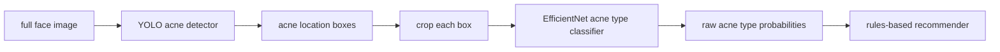

# SkinScan

SkinScan is a computer-vision learning project for acne analysis.

The repo has three separate jobs. Keep them mentally separate:

```text
1. Detector / locator
   Input: full face image
   Output: boxes around acne spots

2. Classifier
   Input: cropped acne spot
   Output: acne type: Blackheads, Cyst, Papules, Pustules, Whiteheads

3. Recommender
   Input: acne concerns
   Output: ingredient/product routine rules
```

This is not medical software. It uses cosmetic concern language only.

## Current Pipeline



## What Is Where

| Thing | Path | Git? | Purpose |
|---|---|---:|---|
| Detector code | `src/detection/` | yes | ACNE04 conversion, visualization, detector checks |
| Detector weights | `models/detection/acne04_yolov8m_best.pt` | no | Stage 1 acne spot locator |
| Detector data | `data/raw/acne04/` | no | ACNE04 images + box labels |
| Classifier code | `src/classification/` | yes | Crop helper, EfficientNet classifier, classifier trainer |
| Classifier weights | `models/classification/acne_model.keras` | no | Stage 2 acne type classifier |
| Classifier data | `data/raw/typeclassification/AcneDataset/` | no | Kaggle acne type dataset |
| Recommendation code | `src/recommendation/` | yes | Concern-to-ingredient rules |
| Config | `configs/default.yaml` | yes | Current model paths and thresholds |
| Generated checks | `runs/` | no | Rendered sheets, predictions, threshold sweeps |

Raw data and model weights are intentionally ignored. The repo tracks code and
documentation; your machine keeps datasets, weights, and generated outputs.

## Stage 1: Detector / Locator

This is the part we are perfecting first.

Goal: given a full ACNE04 face image, draw boxes around acne spots.

Current detector:

```text
weights: models/detection/acne04_yolov8m_best.pt
data:    data/raw/acne04/
conf:    0.07
iou:     0.2
imgsz:   1024
```

Run the detector location check:

```bash
.venv/bin/python -m src.detection.check_acne04_detector
```

Fast smoke test:

```bash
.venv/bin/python -m src.detection.check_acne04_detector --limit 5 --render-limit 5
```

Outputs:

```text
runs/detection_check/gt_green_pred_red_sheet.jpg
runs/detection_check/threshold_sweep.json
```

On ACNE04 validation, the current best operating point is:

```text
conf=0.07, iou=0.2, imgsz=1024
precision=0.697
recall=0.750
F1=0.722
```

Green boxes are ACNE04 labels. Red boxes are the detector predictions.


## Stage 2: Classifier

This model is separate from the detector.

Goal: given one cropped acne spot, predict the type.

Raw output classes:

```python
["Blackheads", "Cyst", "Papules", "Pustules", "Whiteheads"]
```

Training data:

```text
data/raw/typeclassification/AcneDataset/
  train/
  valid/
  test/
```

Training code replicates this Kaggle notebook:

https://www.kaggle.com/code/dadydada/miniproject-ai-6610210284

Train:

```bash
.venv/bin/python -m src.classification.train_type_classifier
```

Inspect dataset counts:

```bash
.venv/bin/python -m src.classification.train_type_classifier --inspect
```

Expected classifier output:

```text
models/classification/acne_model.keras
models/classification/acne_model.keras.labels.json
```

The classifier has not replaced the detector. It only runs after the detector
has produced acne crops.

## Detector To Classifier

Once the classifier weights exist:

```bash
.venv/bin/python -m src.classification.run_acne04_pipeline
```

That does:

```text
ACNE04 image -> detector boxes -> crop boxes -> classify crops
```

## Stage 3: Recommender

The recommender is rules-based, not ML.

Code:

```text
src/recommendation/
```

It maps concerns to ingredients, for example:

```text
comedonal acne     -> salicylic acid / adapalene / azelaic acid
inflammatory acne  -> benzoyl peroxide / azelaic acid / niacinamide
cystic acne        -> soothing support + professional-care flag
```

## Setup

Install dependencies into the local venv:

```bash
python3 -m venv .venv
.venv/bin/python -m pip install -r requirements.txt
```

The raw ACNE04 archives should be stored locally at:

```text
data/raw/acne04/archives/Detection.tar
data/raw/acne04/archives/Classification.tar
```

Extracted ACNE04 should look like:

```text
data/raw/acne04/Detection/VOC2007/Annotations/
data/raw/acne04/Detection/VOC2007/ImageSets/
data/raw/acne04/Classification/JPEGImages/
```

## Do Not Commit

These are intentionally local only:

```text
data/raw/
data/processed/
data/self_collected/
models/
runs/
*.tar
*.pt
*.keras
```

## Short Version

Right now, focus on:

```bash
.venv/bin/python -m src.detection.check_acne04_detector
```

Do not debug classifier or recommender until acne location boxes look right.
