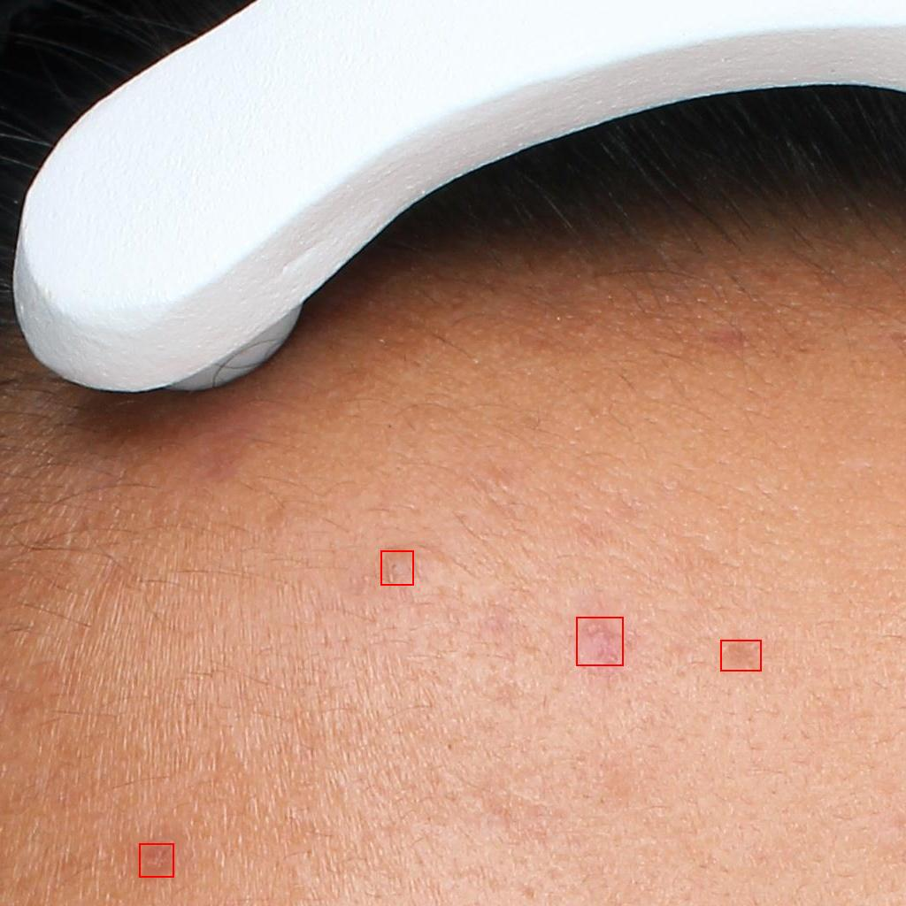
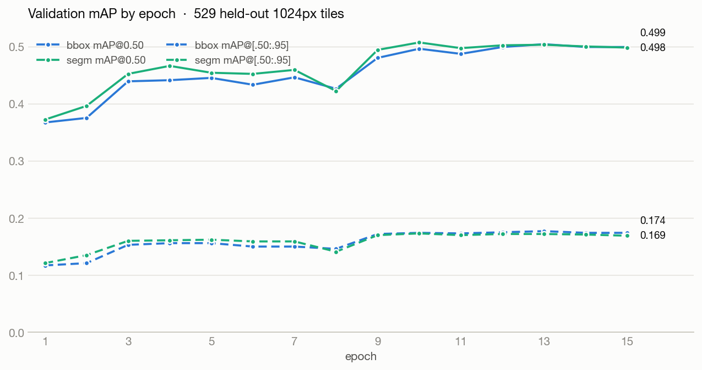
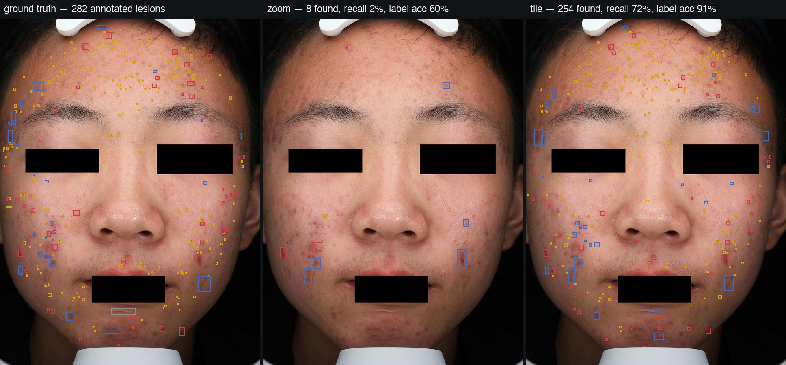

# SkinScan

**Production default: SA-RPN native-tile lesion identification, built as a
research/learning project.** `src.pipeline.e2e` (§9) tiles a face photo into
native-resolution 1024px crops and sends every tile to a **required external
SA-RPN HTTP service** (§7); if that service is unreachable or returns an
invalid response, identification fails outright — there is **no local-model
fallback**. MediaPipe face regions and ITA-based tone estimation are
unchanged. The v3 correctness pipeline then separates triage/referral from
therapy disposition, plans therapeutic intent, applies hard product
eligibility, and validates a one-product-per-role regimen. A routine is
optional: missing reviewed policy or verified catalog data is represented as
deferred/unavailable, never guessed (§6/§9). The original YOLOv8m detector +
EfficientNetB0 classifier two-stage pipeline (§1-§4) is retained in the repo
as a **historical, evaluation-only** reference: it is not called by the
default CLI, and its metrics below describe that superseded pipeline, not
the SA-RPN production path — the detector metrics, the concern-mapping A/B
(§7a), and the recommendation rules (`docs/RULES.md`) are reported
separately; no single measured end-to-end accuracy number exists for the
SA-RPN production pipeline (D-027). Every stage was validated with visual
proof sheets before metrics, and every failed experiment is kept on the
record below.

> Not medical software. Cosmetic-concern language only, no diagnosis.

```mermaid
flowchart LR
    I["face image"] --> T["native 1024px tiles"]
    T --> P["SA-RPN HTTP service<br/>(required, no fallback)"]
    P --> D["cross-tile dedupe"]
    D --> R["regions + tone (ITA)"]
    R --> C["care decision<br/>triage + therapy disposition"]
    C --> P2["reviewed therapy policy<br/>→ role-aware plan"]
    P2 --> E["hard product eligibility"]
    E --> S["eligible-only ranking<br/>→ validated regimen"]
```



## Results at a glance

| Component | Dataset | Result |
|---|---|---|
| **Production identifier — SA-RPN** (Mask R-CNN R50, 10-class) — [`sa-rpn/`](sa-rpn/) | AcneSCU | **mAP@0.50 = 0.499 bbox / 0.498 segm**, recall@0.50 = 0.743 (detector-only; no separate end-to-end pipeline number — D-027) |
| SA-RPN serving A/B: **tile** vs zoom ([§7a](#7a-pipeline-ab--how-should-sa-rpn-see-a-full-photo)) | AcneSCU held-out, 756 lesions | tile **recall 0.70 / label acc 0.92** vs zoom 0.04 / 0.44 → tiles locked ([D-026](docs/DECISIONS.md)), cutover to sole default confirmed ([D-027](docs/DECISIONS.md)) |
| Stage 1 detector (YOLOv8m) — *historical pipeline, evaluation-only* | ACNE04 | **F1 = 0.722** @ conf 0.07 / IoU 0.2 |
| Stage 2 classifier (EfficientNetB0, 5-class) — *historical pipeline, evaluation-only* | Kaggle acne types | **91.2% acc, macro F1 0.92** |
| 6-class `Not_acne` retrain — *historical pipeline attempt* | + harvested negatives | 91.7% acc — **reverted** (crop-domain confound, [D-025](docs/DECISIONS.md)) |
| Learned product ranker (HistGB) | 1.1M Sephora reviews | pairwise 0.584 — **lost** to Bayesian stats baseline (0.609), never shipped |
| Pooled ranker (`StatsRanker`) | same | pairwise **0.609** (the bake-off winner); v3 permits it only as the final tie-break among already eligible equivalents |

All decisions are logged with IDs in [`docs/DECISIONS.md`](docs/DECISIONS.md); the
dead ends are summarized in [§8](#8-wrong-paths--what-failed-and-why).

---

## 0. Method: contracts before models

Before training anything, we locked the data contracts (D-007..D-009): a closed
concern vocabulary, a closed face-region vocabulary, ordinal severity 0–4, and a
catalog schema. The CV stages were then built to *fill* those contracts, so the
recommender never had to chase moving model outputs.

```text
concerns: acne_comedonal | acne_inflammatory | acne_cystic | acne_scarring | hyperpigmentation | dryness
regions:  forehead | nose | left_cheek | right_cheek | chin_jaw | perioral
datasets: ACNE04 (detection) · Kaggle types (classification) · FFHQ (negatives)
          · Sephora ~8k products / 1.1M reviews (ranking) · self photos (TEST-ONLY)
```

---

## 1. Stage 1 — lesion detector

Trained YOLOv8m on ACNE04 (1,457 dermatologist-boxed faces, 18,983 boxes),
single class `lesion`, COCO-pretrained, full fine-tune on a Colab T4 —
walkthrough in [`notebooks/01_acne04_detector.md`](notebooks/01_acne04_detector.md).
We started with YOLOv8-nano and upgraded to medium (D-018) after nano
underperformed.

First step was always eyeballing the labels, not metrics:


Confidence-threshold sweep picked the locked operating point:

```text
weights: models/detection/acne04_yolov8m_best.pt
conf=0.07  iou=0.2  imgsz=1024  →  precision 0.697 / recall 0.750 / F1 0.722
```

The low threshold is deliberate: a missed spot is gone forever, but an extra
crop can still be rejected downstream. Green = ground truth, red = predictions:


---

## 2. Stage 2 — acne type classifier

### 2a. Attempt 1 — ACNE04 crops, labeled by hand

The first classifier was trained on detector crops from ACNE04 that we labeled
ourselves, at concern level: `comedonal, cystic, inflammatory, not_acne,
post_acne_mark`. It didn't hold up:


The diagonal is weak almost everywhere (inflammatory recall 20/56, cystic
10/30). The error audit showed why — at crop scale, fading inflammatory
lesions and post-acne marks are nearly the same red dot:


Two takeaways: (1) self-labeled concern-level crops were too noisy to learn
from; we needed a properly typed dataset. (2) One class *did* work —
`not_acne` was the strongest row (23/36), the first evidence that a learned
reject class is viable. Its negatives came from harvested detector
false-positive crops (hair, shadows, fabric, plain skin):


### 2b. Attempt 2 — Kaggle acne-type dataset, retrained on Colab

We swapped to the Kaggle acne-type dataset (five real types: `Blackheads,
Cyst, Papules, Pustules, Whiteheads`) and retrained EfficientNetB0 on a Colab
T4 ([`notebooks/retrain_stage2_colab.ipynb`](notebooks/retrain_stage2_colab.ipynb)).

Label review first, as always:


```text
runtime: Colab T4 · TF 2.20 · Adam(1e-5) · 150 epochs · best-val checkpoint
split:   train 2778 / valid 921 / test 918
result:  test accuracy ~92% · macro F1 0.92–0.93
```


A clean diagonal this time. Papules↔Pustules is the remaining soft spot (both
inflammatory-looking crops); Whiteheads is the small tail (57 test images)
but scores highest.

---

## 3. End-to-end pipeline

Wiring detector → context crop → classifier; the JSON output keeps box,
detector confidence, crop path, and full probability vector per candidate:

```bash
.venv/bin/python -m src.classification.run_acne04_pipeline --image path/to/image.jpg
```


End-to-end test on a self-collected photo with real acne, using the new
Kaggle-trained model — this one is a *good* result: the detector finds the
lesions and the classifier types them as pustules, which matches the photo:


```text
detections: 16 · type counts: Pustules = 16 · classifier confidence 0.47–1.00
```

The remaining worry: a 5-way softmax still has no way to say "none of these,"
so weak detector boxes (shadows, pores, hair) get forced onto an acne type
too. That's what the `Not_acne` class from attempt 1 was supposed to fix —
next section.

---

## 4. Adding `Not_acne` to the new model — right idea, wrong dataset

`Not_acne` had already worked on the small self-labeled model (§2a), so we
brought it to the Kaggle model. Design
([`docs/STAGE2_NEGATIVES_DESIGN.md`](docs/STAGE2_NEGATIVES_DESIGN.md)): a sixth
class beat probability thresholding (softmax miscalibrated on OOD crops) and a
two-stage binary gate (over-engineered). Negatives = FFHQ clear-skin detector
false positives + non-lesion ACNE04 regions, harvested through the *same*
`crop_with_context` transform the pipeline uses.

On paper the 6-class retrain worked perfectly:

```text
test accuracy 91.72% · macro F1 0.93 (up from 0.92)
only 2/918 real lesion crops misrouted to Not_acne
FFHQ clear-skin reject rate: 99.7% (382/383)
```

**Then the end-to-end run fell apart (D-025).** On real faces the model
classified essentially *every* detector crop `Not_acne` — including crops that
are unmistakably pustules, at confidence 1.00:


Root cause: a **crop-domain confound** — the acne positives were 640×640
Roboflow mosaic images, while the negatives were 224px upscaled pipeline
crops. The model learned crop *style*, not acne. Every dataset-level
acceptance gate passed anyway, because none of them fed real pipeline crops
of a known-acne face through the model.

```text
lesson: dataset-level metrics can be perfect while the deployed model is 100% broken.
fix:    weights reverted to the 5-class model; v2 gates now require a
        real-pipeline check ("Not_acne share on a known-acne image < 50%").
```

The confounded weights are archived as `acne_model_6class_v1_confounded.keras`;
the v2 dataset plan is in [§7](#7-in-progress--stage-2-v2--sa-rpn-replication).

---

## 5. Face regions and skin tone

MediaPipe FaceLandmarker (468 landmarks) assigns each lesion to a face region
via point-in-polygon (D-020); skin tone is estimated by ITA° in CIELAB over
non-lesional forehead/cheek pixels, bucketed light/medium/deep, with
self-report always overriding the photo (D-021).

```text
ITA° = arctan((L* − 50) / b*) · 180/π
```


Green marks the exact pixels sampled for ITA (lesion boxes excluded):


A fairness-eval design ([`docs/FAIRNESS_EVAL_DESIGN.md`](docs/FAIRNESS_EVAL_DESIGN.md))
specifies how the pooled scalars (F1 0.722, acc 91.2%) will be disaggregated by
Fitzpatrick group — ACNE04 ships no tone labels, so ITA is the estimator.

---

## 6. Recommendation layer

**V3: decision → therapy plan → eligibility → ranking → composition →
validation (D-029).** Triage/referral and therapy disposition are independent:
high counts, scarring, or pigment concern may add review language without
suppressing active treatment. Raw detector confidence is never called a
probability. An uncalibrated nodule signal causes an explicit abstention and
supportive-only disposition; a numeric gate is usable only when an approved
policy names its calibrator.

```text
ConcernReport
  → CareDecision(triage_level, referral_reasons, therapy_disposition)
  → TherapyPlan(primary/alternatives/support roles from reviewed policy)
  → hard eligibility(area, role, format, exposure, strength, label, profile,
                      sunscreen, every carried active)
  → eligible-only ranking
  → one selected product per role + disjoint alternatives
  → whole-regimen validation
```

Unknown intake values stay unknown. Production ships no clinician-reviewed
therapy policy, so active therapy is deferred by default. Likewise, legacy or
unenriched catalog rows remain loadable but fail hard eligibility; they cannot
be repaired by a ranker. Product instructions require a named label/policy
source. Fixture policies and verification overlays test the mechanism but are
not clinical approval or real-SKU verification.

**Ranking is subordinate to eligibility.** Concern-specific outcome evidence,
tolerability, evidence completeness, and usable budget precede pooled review
statistics. The historical bake-off remains useful only as a final tie-break:

```text
                         ROC-AUC   pairwise ordering
learned HistGB model      0.659        0.584
global popularity         0.672        0.597
Bayesian-smoothed rating  0.666        0.609   ← pooled tie-break champion
```

**End-to-end output.** Production writes `analysis.json` schema `"3"` even
when catalog/recommendation work is unavailable, preserving the care decision.
It writes `routine.json` only for a valid regimen. Both artifacts contain the
exact normalized profile, semantic-input identities, git state, and the same
replay key. A legacy reader labels v2 artifacts `legacy`; v2 and v3 are never
treated as semantically comparable.

```jsonc
{
  "schema_version": "3",
  "decision": {"triage_level": "routine_plus_review",
               "therapy_disposition": "active_treatment"},
  "therapy_plan": {"primary": null,
                   "deferred_reasons": ["clinician_reviewed_policy_missing"]},
  "selected_products": {},
  "alternatives": {},
  "validation_errors": [],
  "release_eligibility": {"eligible": false, "reasons": ["…"]},
  "replay_key": "sha256…"
}
```

---

## 7. SA-RPN detector — trained, evaluated, and served ✅

Full writeup, code, and reproduction: [**`sa-rpn/`**](sa-rpn/).

Replicated Zhang et al.'s *Learning High-quality Proposals for Acne Detection*
(SA-RPN — a Spatial-Aware RPN with NWD proposal scoring and deformable convs on
Mask R-CNN R50-FPN) on AcneSCU with MMDetection. 275 clinical faces tiled into
1024×1024 crops (4,680 train / 529 val tiles), fine-tuned from COCO for 15 epochs
on a Lightning AI A100. Unlike the shipped YOLOv8m detector (single `lesion`
class), this predicts **10 fine-grained lesion types with per-lesion masks**.

| Metric | bbox | segm | | paper target |
|---|---|---|---|---|
| **mAP @ 0.50** | **0.499** | **0.498** | | AP 0.507 |
| **Recall @ 0.50** | **0.743** | **0.742** | | AR 0.775 |
| mAP @ [.50:.95] | 0.174 | 0.169 | | — |

Validation mAP jumps 0.43 → 0.50 exactly at the epoch-9 LR drop, then plateaus —
the model converged; more epochs at this recipe would not help. Detections on
held-out crops it never trained on (red boxes = model output at conf ≥ 0.5):




Served as a batched [LitServe](https://github.com/Lightning-AI/LitServe) REST API
([`sa-rpn/serve.py`](sa-rpn/serve.py)) with class-agnostic NMS and a confidence
knob. **Caveats:** strict-IoU localization is weak (mAP@0.75 ≈ 0.08) — the next
lever is anchor/mask-head tuning, not more training; and the available mirror
lacks patient IDs, so the paper's patient-disjoint split can't be reproduced
exactly (split is image-level).

## 7a. Pipeline A/B — how should SA-RPN see a full photo?

The model is trained on 1024px tiles of clinical photos; a full face photo has
to be funneled into that input somehow. Two candidates, A/B-tested by
[`src/pipeline/compare_sarpn.py`](src/pipeline/compare_sarpn.py) against the
same served checkpoint on 5 held-out validation images (seed-42 split, 756
annotated lesions), scored against the clinical annotations at IoU ≥ 0.3:

- **zoom** — the (historical) YOLOv8m detector finds acne areas, each cluster
  is cropped and *upscaled* to 1024px ("really enlarge the area"), SA-RPN
  re-detects inside;
- **tile** — the photo is chunked into *native-resolution* 1024px tiles with a
  guaranteed minimum overlap; every tile runs; seams are deduped client-side.

| funnel | recall | precision | exact-label acc | concern acc | API calls (5 imgs) |
|---|---|---|---|---|---|
| zoom | 4% (32/756) | 52% | 44% | 62% | 44 |
| **tile** | **70% (530/756)** | **68%** | **92%** | **95%** | 116 |



Ground truth 282 lesions; zoom surfaced 8, tile surfaced 254 with 91% correct
types. Zoom fails twice: YOLO (imgsz 1024) downscales a 3448×4600 photo ~4×
so the gatekeeper forwards almost nothing, and the upscaled blurry crops halve
SA-RPN's label accuracy versus native pixels. **Decision: native-res tiling,
locked as [D-026](docs/DECISIONS.md).** The identification pipeline is: native
1024px tiles → the required SA-RPN HTTP service (no local fallback — a
transport failure or an invalid response aborts the run) → cross-tile
class-agnostic dedupe → D-020 regions → `ConcernReport`: comedones →
`acne_comedonal`, papules/pustules → `acne_inflammatory`, nodules →
`acne_cystic`, atrophic/hypertrophic scars → `acne_scarring`, melasma →
`hyperpigmentation` (the first CV path to emit a non-acne concern) — see
`SARPN_LABEL_TO_CONCERN`,
[`src/pipeline/sarpn.py`](src/pipeline/sarpn.py). `nevus`/`other` are never
concerns; they surface as visible safety observations
(`analysis["safety_observations"]`), gated by per-label count/confidence
thresholds in `configs/default.yaml`, not silently dropped. This feeds the
V2, evidence-aware recommender contract
([`docs/CONCERN_SCHEMA.md`](docs/CONCERN_SCHEMA.md),
[`docs/RULES.md`](docs/RULES.md)). Honest caveat: clinical images are
tiling's home domain; the consumer-photo check (D-014) gating retirement of
the shipped two-stage pipeline is now the automated
`tests/test_e2e.py::test_fixture_e2e_writes_complete_v2_artifact_set`
fixture-artifact gate, and the production cutover is locked as
[D-027](docs/DECISIONS.md) — §1-§4's YOLOv8m + EfficientNetB0 pipeline is
retained only as a **historical, evaluation-only** reference; the default
`src.pipeline.e2e` no longer calls it, and there is no local-model fallback
if the SA-RPN service is unreachable.

## 7b. In progress — Stage 2 v2 dataset

**Stage 2 v2 dataset** ([`docs/STAGE2_V2_DATASET.md`](docs/STAGE2_V2_DATASET.md)),
motivated by D-025. Auditing the Roboflow training data revealed a second data
problem: augmented copies of the same source face leak across train/val/test
(e.g. Blackheads — 735 train files but only ~91 source images, 61 present in all
three splits). The v2 plan: harvest crops by running the *deployed* detector on
AcneSCU faces (276 faces, 31,777 fine-grained annotations) so train crops match
deployment crops, human-review every label
(`src/classification/curate_acne04_crops.py` audit/harvest/build CLI), and split
by source face *before* augmenting. Seven gates must pass before v2 replaces the
shipped 5-class model.

---

## 8. Wrong paths — what failed, and why

Kept on the record deliberately; half the value of the project is here.

| # | Dead end | Symptom | Root cause | Resolution |
|---|---|---|---|---|
| 1 | YOLOv8-nano detector | weak recall on small dense lesions | model too small | upgraded to YOLOv8m (D-018) |
| 2 | Self-labeled concern-level classifier | weak diagonal; inflammatory ↔ post-acne marks indistinguishable | noisy hand labels, crop too small for concern-level classes | switched to the typed Kaggle dataset (§2b) |
| 3 | 6-class retrain v1 | real pustule crops → `Not_acne` @ 1.00, on acne faces too | crop-domain confound: 640px mosaic positives vs 224px pipeline-crop negatives | reverted to 5-class (D-025); v2 requires real-pipeline gate |
| 4 | Roboflow split trust | v2 audit: same source face in train *and* test | augmentation done before splitting | v2 splits by source face first |
| 5 | Learned product ranker | pairwise 0.584 vs baseline 0.609 | product-anonymous features can't beat per-product memorized stats; 7 probes confirmed structural | shipped `StatsRanker` champion (D-022) |
| 6 | Per-skin-type ranking cells | 0.606/0.596 — *worse* than pooled | cells too sparse | pooled stats, cells evidence-only |
| 7 | Softmax-threshold reject (option B) | — | miscalibrated on OOD, per design analysis | rejected at design stage |
| 8 | Zoom funnel into SA-RPN (YOLO areas → upscaled 1024px crops) | recall 4% vs tiling's 70%; label acc 44% vs 92% | YOLO downscales hi-res photos ~4× and gatekeeps coverage; upscaled crops blur away detail | native-res tiling locked (D-026, §7a) |

The recurring lesson: **every proxy metric passed while the real thing was
broken** — which is why each stage now has a visual proof sheet and a
real-pipeline acceptance gate, not just held-out accuracy.

---

## 9. Run it

```bash
python3 -m venv .venv
.venv/bin/python -m pip install -r requirements.txt

# MediaPipe face landmarker (local, gitignored)
mkdir -p models
curl -fL -o models/face_landmarker.task \
  https://storage.googleapis.com/mediapipe-models/face_landmarker/face_landmarker/float16/latest/face_landmarker.task
```

**Default production path** needs a required, already-running SA-RPN HTTP
service (`sa-rpn/serve.py`, §7). There is **no local-model fallback** — if
the endpoint is unreachable or returns a malformed response,
`src.pipeline.e2e` exits non-zero and leaves any previously published output
directory untouched (identification runs before anything is staged, and a
successful run publishes through an atomic staged swap, so a failure never
partially overwrites a prior result):

```bash
.venv/bin/python -m src.pipeline.e2e \
  --image path/to/image.jpg \
  --api http://localhost:8000/predict \
  --profile path/to/profile.json \
  [--catalog data/processed/catalog.json] \
  [--therapy-policy path/to/clinician-reviewed-policy.json] \
  [--recsys --recsys-data-root recsys/data/derived \
   --recsys-catalog recsys/data/derived/catalog_full.json] \
  [--dataset-name cohort-name --sample-id sample-1 \
   --dataset-split valid --split-proof manifest-sha256 \
   --detector-sha256 immutable-model-sha256]
```

For evaluation-only annotation counterfactuals, add
`--oracle-annotations path/to/AcneSCU.xml`. That mode reads the actual VOC XML,
does not call the detector service, binds the annotation file hash into the
replay key, and tags the semantic evidence source as `oracle`. Compare it only
with a prediction run of the same source image.

Full CLI options: `--image, --out, --api, --catalog, --face-landmarker,
--tile-size, --overlap, --connect-timeout, --read-timeout,
--request-batch-size, --min-score, --dedupe-threshold, --profile, --skin-type,
--pregnancy-status, --pregnant` (legacy migration), `--therapy-policy,
--dataset-name, --sample-id, --dataset-split, --split-proof,
--detector-sha256, --oracle-annotations, --recsys, --recsys-data-root,
--recsys-catalog, --top`. Profile defaults are explicit
unknowns; conflicting legacy/new pregnancy inputs fail before detector HTTP
work. Writes into
`runs/e2e/<image stem>/` (or `--out`):

```text
analysis.json          always — schema_version "3", detections, concerns,
                        decision, provenance, recommendation_status
routine.json           optional — only for a validated v3 regimen
recommendations.json   optional — standalone recsys-1 output with --recsys
detections.jpg
region_overlay.jpg
lesion_sheet.jpg
```

`recommendation_status` is `"complete"` when the required regimen validates,
`"partial"` when a validated support regimen is preserved but reviewed primary
treatment is unavailable/deferred, `"invalid"` when whole-regimen validation
rejects it, or `"unavailable"` (with a `recommendation_reason`) otherwise.
Missing or invalid catalog/policy data never erases the identification result
or its care decision. The repository default policy is explicitly unreviewed,
so release eligibility remains blocked.

Smoke-test the SA-RPN service directly before pointing the CLI at it:

```bash
curl -fsS http://localhost:8000/predict \
  -H 'Content-Type: application/json' \
  --data "{\"image\":\"$(python -c 'import base64,sys; print(base64.b64encode(open(sys.argv[1],\"rb\").read()).decode())' path/to/image.jpg)\"}"
```

Then run the full pipeline against it:

```bash
python -m src.pipeline.e2e \
  --image path/to/image.jpg \
  --api http://localhost:8000/predict \
  --out runs/e2e/sarpn-smoke
```

Catalog enrichment keeps raw rows storage-valid and writes deterministic role
quarantine reasons. Only authoritative, timestamped overlay fields can make a
row eligible:

```bash
python -m src.recommendation.import_catalog \
  --csv data/raw/sephora/product_info.csv --format sephora \
  --verification verified_products.json \
  --out data/processed/catalog.json \
  --quarantine-out data/processed/catalog_quarantine.json
```

Run a resumable manifest with atomic per-stage checkpoints:

```bash
python -m src.pipeline.batch \
  --requests batch_requests.json \
  --manifest runs/e2e/batch_manifest.json
```

Stages are `identified → regions_and_concerns → decision_and_recommendation →
rendered → published`. Only transient transport/timeouts/5xx failures retry;
resume reuses fresh identification observations and invalidates only the first
stage affected by changed source/model/config/profile/catalog/policy inputs.

Release evaluation accepts v3 run directories plus a split-proven cohort
manifest. It rejects train/unknown, dirty, stale, duplicate, unknown-detector,
and mixed-input aggregates. Every manifest row must bind the exact run,
split-proof identity, source-image SHA-256, and evidence source. Prediction-
derived and oracle-derived counterfactual reports must be evaluated separately
before comparison:

```bash
python -m src.evaluation.e2e_release \
  --runs runs/e2e/sample-* \
  --manifest cohort_manifest.json \
  --out runs/e2e/release_report.json
```

The report remains `blocked` until real clinician policy approval, an adequate
calibration cohort, an external clinician-reviewed set, a verified real catalog
overlay, and immutable remote detector identity all exist. Code completion and
synthetic fixtures do not satisfy those external release gates.

Individual stages, and the **historical, evaluation-only** two-stage
pipeline (§1-§4 — not called by the default `src.pipeline.e2e` command
above):

```bash
.venv/bin/python -m src.detection.check_acne04_detector          # historical: detector proof sheet
.venv/bin/python -m src.classification.run_acne04_pipeline \
  --image path/to/image.jpg                                      # historical: detect + classify
.venv/bin/python -m src.pipeline.regions IMG --boxes PRED_JSON   # region overlay (still used)
.venv/bin/python -m src.pipeline.tone    IMG --boxes PRED_JSON   # ITA sampling overlay (still used)
.venv/bin/python -m src.pipeline.compare_sarpn --image IMG \
  --api http://localhost:8000/predict                            # SA-RPN tile/zoom A/B (§7a)
```

Tests (default tier is model-free; the second tier needs local weights):

```bash
.venv/bin/python -m pytest
SKINSCAN_REAL_FACE_IMAGE=path/to/photo.jpg .venv/bin/python -m pytest -m real_models
```

<details>
<summary>Optional: rebuild the recommendation data (Sephora catalog, ingredient KB, concern labels, ranker)</summary>

```bash
# The learned-ranker bake-off (src.recommendation.ranker, StatsRanker) was
# deleted in 5c07cab; review-derived ranking now lives in the recsys signal
# stores — see "Rebuild the data" in recsys/README.md:
.venv/bin/python -m recsys.tools.build_review_stats --raw-dir data/raw/sephora \
  --catalog recsys/data/catalog/seed_catalog.json \
  --out recsys/data/signals/review_stats.v1.json --data-root recsys/data

# Ingredient KB + tier-2 catalog (manual download; dataset is CC-BY-NC-4.0):
mkdir -p data/raw/beautyapi
curl -L -o data/raw/beautyapi/beauty_data.jsonl \
  https://huggingface.co/datasets/thebeautyapi/beautyproducts/resolve/main/beauty_data.jsonl
.venv/bin/python -m src.recommendation.ingredient_kb
.venv/bin/python -m src.recommendation.import_catalog \
  --csv data/raw/sephora/product_info.csv --format sephora \
  --kb data/processed/ingredient_kb.json \
  --quarantine-out data/processed/catalog_quarantine.json
.venv/bin/python -m src.recommendation.import_catalog \
  --csv data/raw/beautyapi/beauty_data.jsonl --format beautyapi \
  --kb data/processed/ingredient_kb.json --out data/processed/catalog_tier2.json

# Concern-efficacy labeling (D-023; needs OPENROUTER_API_KEY, budget-capped):
.venv/bin/python -m src.recommendation.concern_labels probe
.venv/bin/python -m src.recommendation.concern_labels calibrate
.venv/bin/python -m src.recommendation.concern_labels label --yes --p2-approved
# (src.recommendation.concern_stats was deleted in 5c07cab; the recsys store replaces it)
.venv/bin/python -m recsys.tools.build_concern_efficacy \
  --labels data/processed/review_concern_labels.jsonl \
  --catalog recsys/data/catalog/seed_catalog.json \
  --out recsys/data/signals/concern_efficacy.v1.json --data-root recsys/data
# Add --prompt-version p11 when the append-only labels file contains older
# policy versions; a mixed-version build is refused unless one is selected.
```

</details>

---

## Repo map

```text
sa-rpn/                SA-RPN Mask R-CNN detector (§7): training, serving API, results
docs/DECISIONS.md      every decision (D-001..D-027), including the reversals
docs/*.md              design docs: negatives, v2 dataset, rules, schemas, fairness
notebooks/             Colab sessions: detector training, Stage 2 retrain, SA-RPN
src/detection/         YOLO checks + AcneSCU/SA-RPN preprocessing (historical/eval-only)
src/classification/    classifier training, pipeline, v2 crop curation (historical/eval-only)
src/pipeline/          SA-RPN e2e, provenance/replay, resumable batch, regions/tone
src/recommendation/    v3 decision/therapy/eligibility/composer/validator + legacy tools
src/evaluation/        v3 release preflight, safety metrics, counterfactual comparison
assets/                the proof sheets embedded above
tests/                 model-free by default; real_models tier for local weights
```

Raw data, model weights, and run outputs are local-only (gitignored):
`data/raw/ · data/processed/ · data/self_collected/ · models/ · runs/`.
