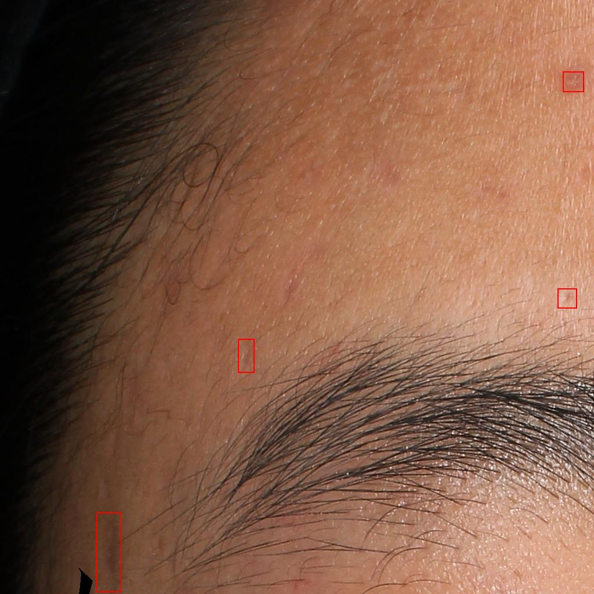
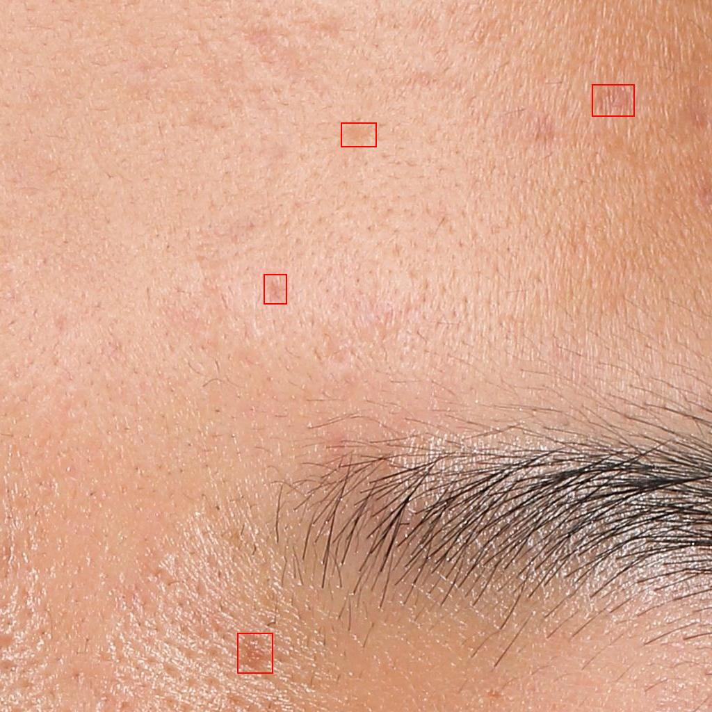
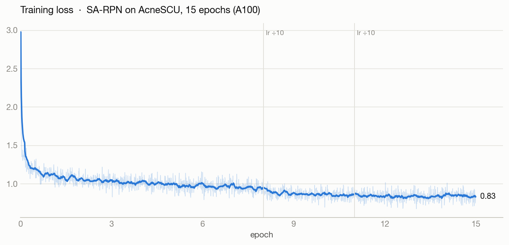
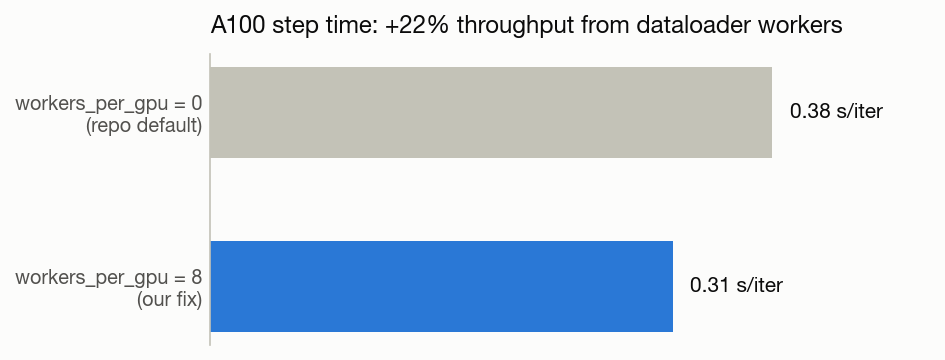

# SA-RPN Detector — Acne Lesion Instance Segmentation (SkinScan component)

> Part of [**SkinScan**](../README.md). This is the SA-RPN replication workstream from
> the main README's Section 7, brought from "in progress" to trained-and-served.

Instance segmentation of facial acne lesions: an SA-RPN–enhanced Mask R-CNN trained on the
AcneSCU clinical dataset, served as a batched REST API. Detects and classifies **10 lesion
types** (papules, pustules, comedones, nodules, scars, …) in high-resolution face photos.
Unlike SkinScan's shipped YOLOv8m detector (single `lesion` class), this model predicts
fine-grained lesion type **and** per-lesion masks in one pass.

---

## 1. What we did

| Stage | What happened |
|---|---|
| **Data** | AcneSCU ([Roboflow mirror](https://universe.roboflow.com/acnescu-0mqwx/acnedetection-exshg), 275 clinical images, VOC masks) → tiled into **1024×1024 crops**: 247 images → **4,680 train tiles / 36,211 annotations**, 28 held-out images → **529 val tiles / 4,542 annotations** (`prepare_acnescu_sa_rpn.py`, seed 42) |
| **Model** | The authors' [SA-RPN implementation](https://github.com/pingguokiller/acnedetection) — Mask R-CNN R50-FPN with a Spatial-Aware RPN, NWD proposal scoring, and deformable convolutions — fine-tuned from COCO weights |
| **Training** | 15 epochs, batch 2, SGD lr 0.002 (÷10 at epochs 9 and 12), on a **1× A100** Lightning AI Studio; ~3 h wall clock across two machine windows with automatic checkpoint resume |
| **Fixes along the way** | Thunder Compute's GPU virtualization couldn't run the legacy CUDA stack (torch 1.9/mmcv 1.4) → moved to Lightning; repo shipped `workers_per_gpu=0`, starving the GPU → raised to 8 for **+22% throughput** |
| **Serving** | `serve.py` — a [LitServe](https://github.com/Lightning-AI/LitServe) API with request batching, class-agnostic NMS, and a confidence threshold knob |

## 2. Results

### The model, on held-out validation crops it never saw in training

| | | |
|---|---|---|
|  |  |  |

Every red box above is a model detection at confidence ≥ 0.5 — no ground truth shown. A typical
API response for the left image:

```json
{"count": 4, "detections": [
  {"label": "papule",        "score": 0.922, "bbox": [651.5, 697.3, 704.3, 752.9]},
  {"label": "papule",        "score": 0.837, "bbox": [157.0, 953.6, 196.2, 991.6]},
  {"label": "atrophic_scar", "score": 0.763, "bbox": [814.4, 723.1, 860.2, 758.9]},
  {"label": "open_comedo",   "score": 0.583, "bbox": [430.7, 622.7, 467.3, 661.1]}]}
```

### Training curves



Loss falls from 3.0 to **0.83** over 15 epochs (35,100 iterations). The two step-decays of the
learning rate are visible as flattening changes in the curve.


Validation mAP plateaus around epoch 4 at the initial learning rate, **then jumps 0.43 → 0.50
right after the first lr drop (epoch 9)** — the classic step-schedule signature. bbox and segm
quality track each other closely, and the curves are flat by epoch 13: the model converged;
more epochs at this recipe would not have helped.

### Final metrics (epoch 15, 529 val tiles)

| Metric | bbox | segm |
|---|---|---|
| **mAP @ IoU 0.50** | **0.499** | **0.498** |
| mAP @ IoU 0.50:0.95 | 0.174 | 0.169 |
| mAP @ IoU 0.75 | 0.078 | 0.063 |
| **Recall @ IoU 0.50** | **0.743** | **0.742** |

Reading: the model **finds ~74% of lesions** and half of its localizations are solid at the
standard IoU 0.50 bar, but boxes/masks are loose at strict overlap (mAP@0.75) — expected for
tiny, diffuse lesions, and the known improvement axis (anchor sizes, mask head resolution)
rather than more training.

### Engineering: the one-line config fix worth 22%



The upstream repo ships `workers_per_gpu=0` — all JPEG decode and augmentation ran on the main
process, blocking the GPU between batches. Setting it to 8 cut step time from 0.38 → 0.31 s/iter.

## 3. Explanation

### Architecture

The model is **Mask R-CNN (ResNet-50 + FPN)** with the paper's three additions:

1. **SA-RPN (Spatial-Aware RPN)** — the standard RPN's classification and localization heads are
   disentangled into a double head, improving proposal quality for hard, small lesions;
2. **NWD proposal scoring** — each proposal also predicts its Normalized Wasserstein Distance
   (the `loss_rpn_nwd` term in our training logs), which correlates confidence with IoU far
   better than plain objectness for tiny boxes;
3. **Deformable convolutions (DCNv2)** in ResNet stages 2–4, letting receptive fields adapt to
   irregular lesion shapes.

Initialization is from COCO Mask R-CNN weights; only the 1024px crop pipeline and the 10-class
heads differ from the paper's setup.

**Papers:** [SA-RPN: A Spatial Aware Region Proposal Network for Acne Detection (IEEE JBHI 2023)](https://ieeexplore.ieee.org/document/10216287/)
· [arXiv preprint: Learning High-quality Proposals for Acne Detection](https://arxiv.org/abs/2207.03674)
· [authors' code](https://github.com/pingguokiller/acnedetection)

### Classes

`closed_comedo, open_comedo, papule, pustule, nodule, atrophic_scar, hypertrophic_scar, melasma, nevus, other`

### Known limits

- Val split is 28 source patients' images — metrics have real variance; don't over-read ±0.01.
- Faint flat marks (macules/erythema) are under-detected — visible in qualitative review.
- Strict-IoU localization is weak (mAP@0.75 ≈ 0.08); next lever is anchor/mask-head tuning, not epochs.
- The Roboflow mirror has 275 of the paper's 276 images and no patient IDs, so the split is
  image-level, not patient-level.

## Reproduce

```bash
# 1. data + training (any Ampere-or-older GPU box, ~6GB VRAM needed)
./setup_train_thunder.sh          # builds py3.8/torch1.9/mmcv1.4 env, preps data, trains 15 epochs

# 2. serve the trained model
pip install 'litserve==0.1.5'     # last py3.8-compatible release
PYTHONPATH=acnedetection CKPT=epoch_15.pth python serve.py   # -> http://localhost:8000/predict

# 3. test with any face photo
python test_client.py face.jpg    # prints detections, writes pred_vis.jpg
```

Key files: [`epoch_15.pth`](epoch_15.pth) (trained weights, 341 MB) ·
[`serve.py`](serve.py) (API) · [`test_client.py`](test_client.py) ·
[`prepare_acnescu_sa_rpn.py`](prepare_acnescu_sa_rpn.py) (VOC→COCO tiler) ·
[`setup_train_thunder.sh`](setup_train_thunder.sh) (end-to-end training) ·
[`assets/train_logs/`](assets/train_logs/) (full mmdet logs the charts are built from)
